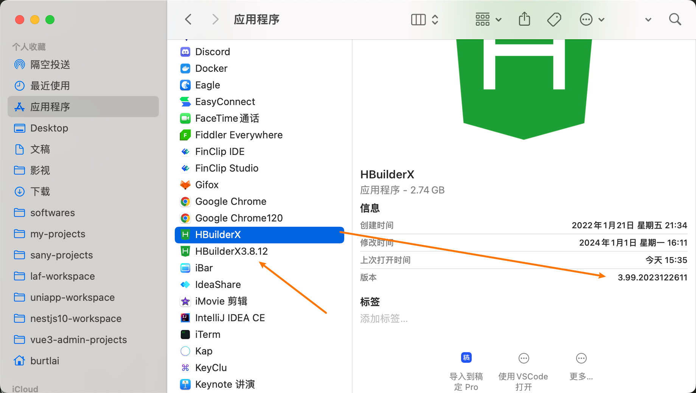

# **APP 打包注意事项**

本模板使用的是 `3.8.12` 的库版本(`"@dcloudio/uni-app": "3.0.0-3081220230817001",`)，所以尽量使用 `3.8.12` 版本的 `HBuilderX` 来打包，否则可能有未知的风险，出现情况如下图。

点击 `ignore` 后可以正常使用，万一以后出现什么特殊情况，记得看看是不是版本问题。

> tips: mac 可以安装多个版本的软件，
> 

## arr.at(-1) 真机运行报错

通过设置 `vite.config.ts` `build.target` 设置为 `es2015` 未能解决。

只好使用传统方法替换 `at()` 。
