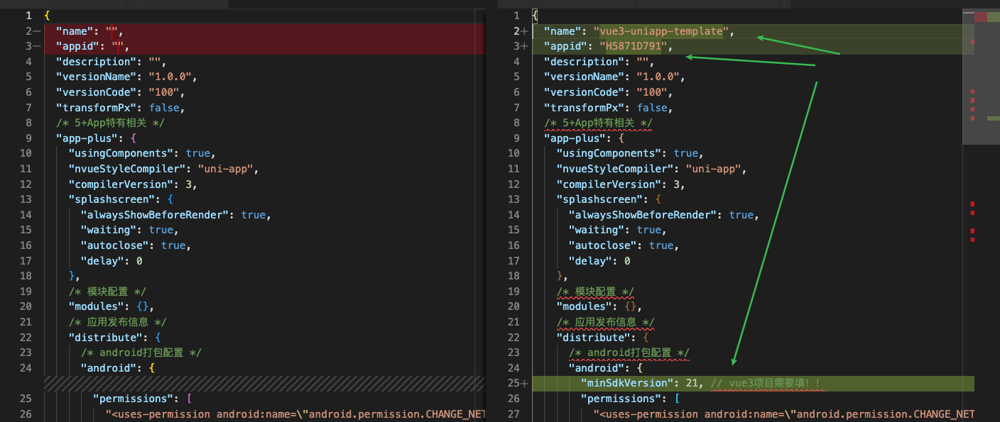
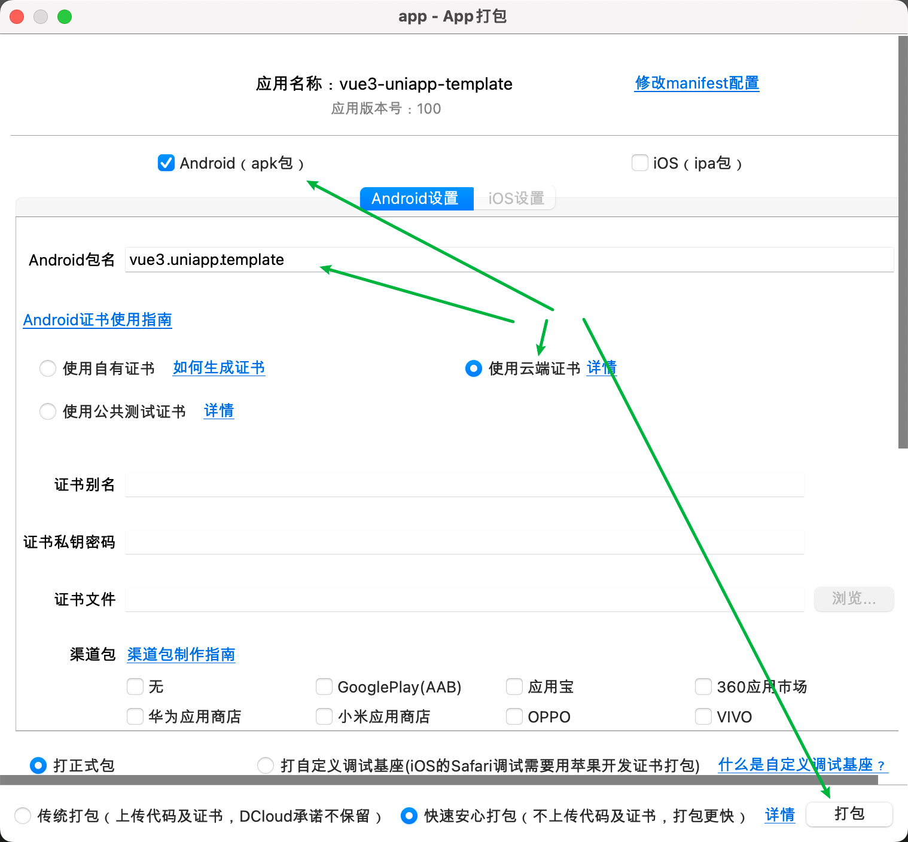
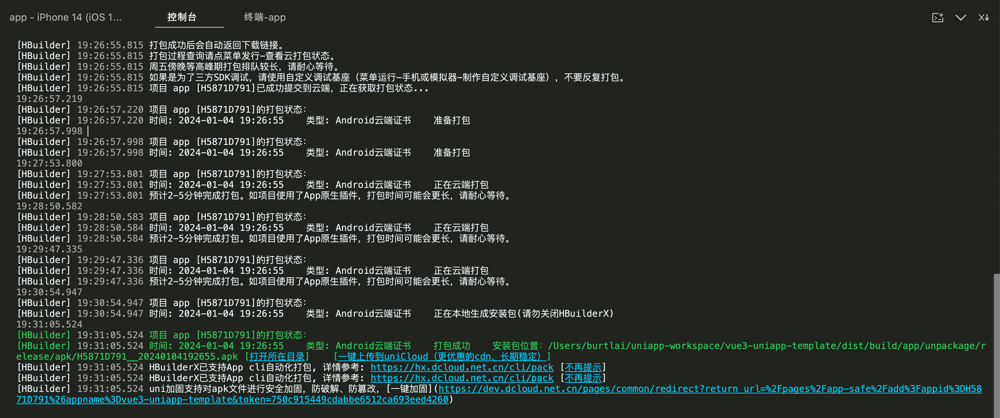
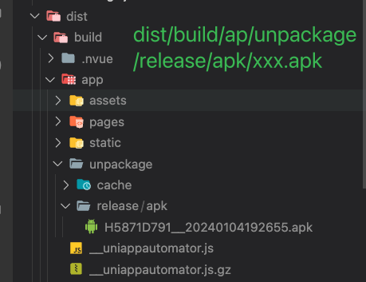
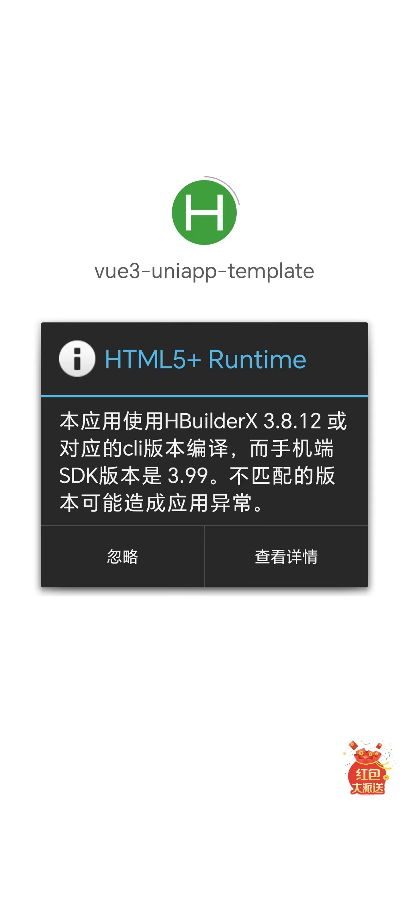

# issue

## app 打包成apk运行，页面空白

- `pnpm build:app`
- **注意，app运行完后不支持本地跑，就是说HBuildX打开生成的app文件夹也跑不了**
- 需要配置 `manifest.json`，有3个地方需要填，如下图
  
- 然后打开HBuildX--发行--原生APP云打包，然后出现如下图，按图填写即可。
  
- 打包成功如下图
  
- 生成的apk路径
  
- 运行报错如下图
  
- 官方链接：[https://ask.dcloud.net.cn/article/35627](https://ask.dcloud.net.cn/article/35627)
- 安装历史版本的HBuildX: [https://hx.dcloud.net.cn/Tutorial/HistoryVersion](https://hx.dcloud.net.cn/Tutorial/HistoryVersion)，然后在百度云盘里面下载，下载HBuildX3.8.12的（因为本地的cli对应的HBuildX版本为3.8.12）
- 使用刚下载的旧版HBuildX云打包，一切顺利，但是最终打包的apk在手机安装后，运行出来的是白屏！（除了tabbar啥都么有，郁闷，PS：tabbar可以切换，但是都是空白页面）
  
