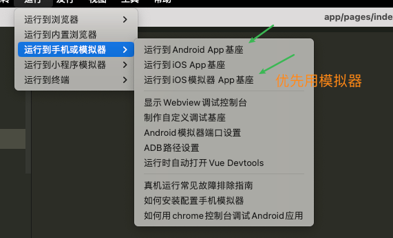
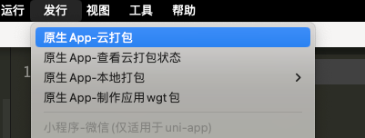

# unifly

（原名 vue3-uniapp-template）

由 Vue3 & Ts & Vite4 & uni-app & UnoCss & UniUI 驱动的跨端快速启动模板，VS Code + Prettier +ESLint + husky + lint-staged + commitlint

## 特性

- ⚡️ [Vue 3](https://github.com/vuejs/core), [Vite](https://github.com/vitejs/vite), [pnpm](https://pnpm.io/), [esbuild](https://github.com/evanw/esbuild) - 就是快！

- 📦 [组件自动化加载](./src/components)

- 📑 pinia+适用于多端的持久化方案

- 🎨 [UnoCSS](https://unocss.dev/) - 高性能且极具灵活性的即时原子化 CSS 引擎

- 😃 [UnoCSS Icons](https://unocss.dev/presets/icons), [海量图标-https://icones.js.org/](https://icones.js.org/)

- 🔥 使用 [新的 `<script setup>` 语法](https://github.com/vuejs/rfcs/pull/227)

- 📥 [API 自动加载](https://github.com/antfu/unplugin-auto-import) - 直接使用 Composition API 无需引入

- 🦾 [TypeScript](https://www.typescriptlang.org/) & [ESLint](https://eslint.org/) & [stylelint](https://stylelint.io/) - 保证代码质量

- 🗂 [husky](https://typicode.github.io/husky/) & [lint-staged](https://github.com/lint-staged/lint-staged) + [commitlint](https://commitlint.js.org/) - 保证代码提交质量

- 🗂 ES6 import 顺序自动排序，css 属性自动排序，增强编码一致性

- 🗂 使用请求拦截器，封装好您的请求

- 🗂 图片自动压缩，再也不用去tinyPng等网站压缩图片了

- 🗂 多环境配置分开，想则怎么配置就怎么配置

## 业务功能 TODO LIST

- [x] 页面下拉刷新（全局+局部）
- [x] 页面上拉加载
- [x] 导航栏返回or去首页
- [x] 导航栏渐变（微信+h5)
- [x] 自定义导航栏顶部机型适配
- [x] 微信小程序分享（好友+朋友圈）
- [ ] 微信登录
- [ ] 微信一键登录（基于手机号）
- [ ] 仿BOSS直聘-个人中心
- [ ] 仿华为商城-个人中心
- [ ] 页面悬浮球(floating bubble)
- [ ] 多tab列表功能
- [ ] 瀑布流
- [ ] 头像上传
- [ ] 图片剪辑
- [x] 抽奖-九宫格抽奖
- [ ] 抽奖-大转盘抽奖
- [ ] 仿网易云音乐APP（独立项目）

## 环境

- pnpm>=8.12
- node>=18

## 仓库地址

- github

  - ~~`https://github.com/fly-vue3-templates/vue3-uniapp-template`~~ （旧地址）

  - `https://github.com/codercup/unifly` （新地址）

- gitee

  - ~~`https://gitee.com/fly-vue3-templates/vue3-uniapp-template.git fly`~~ （旧地址）

  - `https://gitee.com/codercup/unifly` （新地址）

> 旧地址也可以访问，会自动跳转到新地址

## 运行

- web平台： `pnpm dev:h5`, 然后打开 [http://localhost:9000/](http://localhost:9000/)。
- weixin平台：`pnpm dev:mp-weixin` 然后打开微信开发者工具，导入本地文件夹，选择本项目的`dist/dev/mp-weixin` 文件。
- APP平台：`pnpm dev:app`, 然后打开 `HBuilderX`，导入刚刚生成的`dist/dev/app` 文件夹，选择运行到模拟器，或者运行的安卓/ios基座。
  

## 发布

- web平台： `pnpm build:h5`，打包后的文件在 `dist/build/h5`，可以放到web服务器，如nginx运行。如果最终不是放在根目录，可以在 `vite.config.ts` 的 `base` 属性进行配置。[vite官网](https://cn.vitejs.dev/config/shared-options.html#base)
- weixin平台：`pnpm build:h5`, 打包后的文件在 `dist/build/mp-weixin`，然后通过微信开发者工具导入，并点击右上角的“上传”按钮进行上传。
- APP平台：`pnpm build:app`, 然后打开 `HBuilderX`，导入刚刚生成的`dist/build/app` 文件夹，选择发行 - APP云打包。

  

## **APP 打包注意事项**

本模板使用的是 `3.8.12` 的库版本(` "@dcloudio/uni-app": "3.0.0-3081220230817001",`)，所以尽量使用 `3.8.12` 版本的 `HBuilderX` 来打包，否则可能有未知的风险，出现情况如下图。

点击 `ignore` 后可以正常使用，万一以后出现什么特殊情况，记得看看是不是版本问题。

> mac 可以安装多个版本的软件，
> 

## 给作者加鸡腿

如果你觉得不错，请给作者加鸡腿~

