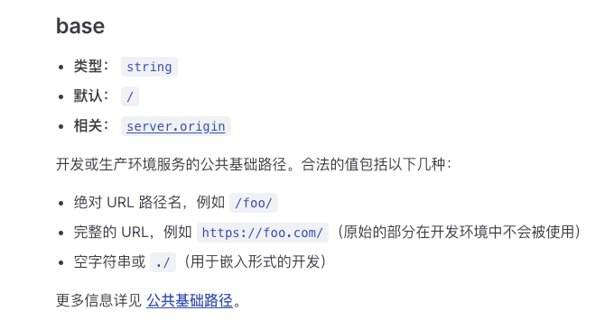

# vue3-uniapp-template

## 特性

- ⚡️ [Vue 3](https://github.com/vuejs/core), [Vite](https://github.com/vitejs/vite), [pnpm](https://pnpm.io/), [esbuild](https://github.com/evanw/esbuild) - 就是快！

- 📦 [组件自动化加载](./src/components)

- 📑 pinia+适用于多端的持久化方案

- 🎨 [UnoCSS](https://github.com/unocss/unocss) - 高性能且极具灵活性的即时原子化 CSS 引擎

- 😃 [各种图标集为你所用](https://github.com/antfu/unocss/tree/main/packages/preset-icons)

- 🔥 使用 [新的 `<script setup>` 语法](https://github.com/vuejs/rfcs/pull/227)

- 📥 [API 自动加载](https://github.com/antfu/unplugin-auto-import) - 直接使用 Composition API 无需引入

- 🦾 [TypeScript](https://www.typescriptlang.org/) & [ESLint](https://eslint.org/) & [stylelint](https://stylelint.io/) - 保证代码质量

- 🗂 [husky](https://typicode.github.io/husky/) & [lint-staged](https://github.com/lint-staged/lint-staged) + [commitlint](https://commitlint.js.org/) - 保证代码提交质量

- 🗂 ES6 import 顺序自动排序，css 属性自动排序，增强编码一致性

- 🗂 使用请求拦截器，封装好您的请求

- 🗂 图片自动压缩，再也不用去tinyPng等网站压缩图片了

- 🗂 多环境配置分开，想则怎么配置就怎么配置

## 环境

- pnpm>=8.12
- node>=16

## 运行

- web平台： `pnpm dev:h5`, 然后打开 [http://localhost:9000/](http://localhost:9000/)。
- weixin平台：`pnpm dev:mp-weixin` 然后打开微信开发者工具，导入本地文件夹，选择本项目的`dist/dev/mp-weixin` 文件。

## 发布

- web平台： `pnpm build:h5`，打包后的文件在 `dist/build/h5`，可以放到web服务器，如nginx运行。如果最终不是放在根目录，可以在 `vite.config.ts` 的 `base` 属性进行配置。[vite官网](https://cn.vitejs.dev/config/shared-options.html#base)
  
- weixin平台：`pnpm build:h5`, 打包后的文件在 `dist/build/mp-weixin`，然后通过微信开发者工具导入，并点击右上角的“上传”按钮进行上传。
