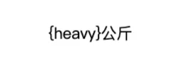

# 多语言篇

`多语言` 是一个常见的需求， `unibest` 专门开发了一个 `i18n`模板，可以直接生成 `多语言模板项目`。

```sh
pnpm create unibest my-project -t i18n
```

`vue组件` 里面使用方式如下：

```html
<view class="m-4">{{ $t('app.name') }}</view>
```

`非vue组件` 里面怎么使用呢？比如 `ts` 文件。

这时需要用到作者编写的 `translate` 函数，使用方式如下：

```ts
import { translate as t } from '@/locale/index'

/** 非vue 文件使用 i18n */
export const testI18n = () => {
  console.log(t('app.name'))
  // 下面同样生效
  uni.showModal({
    title: 'i18n 测试',
    content: t('app.name'),
  })
}
```

上面基本的使用都是没问题的，但是传递参数时，只有 `H5端` 生效，`其他端` 是不生效的，代码如下：

```html
<view class="m-4">{{ $t('weight', { heavy: 100 }) }}</view>
```

`H5端` 效果如下，正常显示：


`非H5端` 效果如下，异常显示：



下面我们就来处理这个问题。

## 多语言传参

上面提到 `vue-i18n` 在 `非H5端` 传参时显示异常，那我们就来处理一下，主要方式就是通过 `正则` 替换 `多语言字符串`。

编写一个函数 `formatI18n`，如下：

```ts
/**
 * formatI18n('我是{name},身高{detail.height},体重{detail.weight}',{name:'张三',detail:{height:178,weight:'75kg'}})
 * 暂不支持数组
 * @param template 多语言模板字符串，eg: `我是{name}`
 * @param obj 需要传递的对象，里面的key与多语言字符串对应，eg: `{name:'菲鸽'}`
 * @returns
 */
export function formatI18n(template, data) {
  const match = /\{(.*?)\}/g.exec(template)
  if (match) {
    const variableList = match[0].replace('{', '').replace('}', '').split('.')
    let result = data
    for (let i = 0; i < variableList.length; i++) {
      result = result[variableList[i]] || ''
    }
    return formatStr(template.replace(match[0], result), data)
  } else {
    return template
  }
}
```

`vue组件` 里面使用方式如下：

```html
<view class="m-4">{{ formatI18n(translate('introduction'), user) }}</view>
```

用到的函数引入如下：

```js
import { formatI18n, translate } from '@/locale/index'
```

对应的 en.json 文件如下：

```json
{ "introduction": "I am {name},height:{detail.height},weight:{detail.weight}" }
```

`user` 对象如下：

```js
{name:'张三',detail:{height:178,weight:'75kg'}}
```

这样，在 `H5端` 和 `非H5端` 都能正常显示，如下：


very good !

## 导航栏标题

目前发现 `导航栏标题` 在 `小程序端` 不会跟随多语言切换而切换，比如说刚开始是中文，切换成英文后，页面内容都变成英文了，标题栏还是中文。

> `App端` 说明：`App模拟器`，以我的 `mac电脑` `ios模拟器` 来说，是正常的，可以直接切换，多语言也是生效的。
>
> 但是 `安卓真机` 会出现`切换多语言后，自动重启，然后界面多语言是生效的`。
>
> 既然 `App 正常`，这里主要说 `小程序端` 不正常的处理。

`小程序端` 需要使用 `uni.setNavigationBarTitle` 来手动处理，`API` 使用如下：

```js
uni.setNavigationBarTitle({
  title: '新的标题',
})
```

结合 `translate` 函数，则：

```js
uni.setNavigationBarTitle({
  title: translate('app.name'),
})
```

可以满足大部分场景。

## tabbar 标题

同 `导航栏标题`。

## App 端视频

这里给出 `2` 个 `App端` 的视频，加深开发者的认识和印象。

:::details

### `ios模拟器` 多语言直接就是生效的

<video src="./assets/10-ios.mp4" controls="controls" width="100%" height="100%"></video>

### `安卓真机` 会自动重启，重启后界面多语言是生效的

<video src="./assets/10-android.mp4" controls="controls" width="100%" height="100%"></video>
:::

## 总结

本文介绍了 `unibest` 里面使用 `多语言` 的基本方式，还处理了 `3` 个多端异常的问题：

- `多语言传参` 不生效 BUG
- `导航栏标题` 切换多语言不生效 BUG
- `tabbar标题` 切换多语言不生效 BUG

全文完~
