# 运行发布

## 运行

- `h5 平台`： `pnpm dev:h5`（ 或者简单点 `pnpm dev` ），然后浏览器打开 `http://localhost:9000/`。
- `wx 小程序`：`pnpm dev:mp-weixin`，然后打开微信开发者工具，导入本地文件夹，选择本项目的 `dist/dev/mp-weixin` 文件。
- 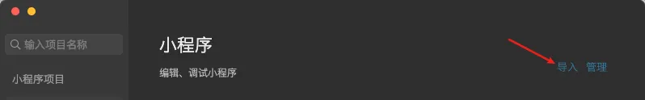

- `APP 平台`：`pnpm dev:app`，然后打开 `HBuilderX`，导入刚刚生成的 `dist/dev/app` 文件夹，选择运行到 `模拟器`( `开发时优先使用` )，或者 `运行到安卓/ios 基座` (真机调试时使用) 。

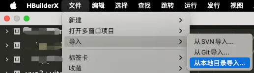

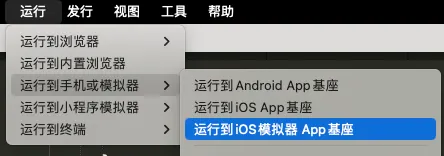
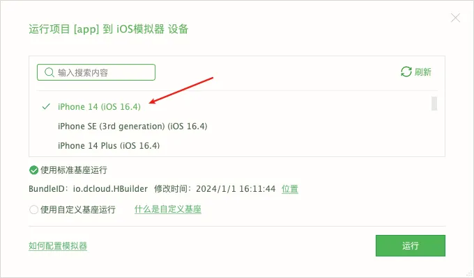

> 如果需要配置其他模拟器，可以参考：[安装模拟器](https://uniapp.dcloud.net.cn/tutorial/run/installSimulator.html)

> 这样操作的话，开发时都会有热更新，开发体验很爽！

## 发布

- `h5 平台`： `pnpm build:h5`，打包后的文件在 `dist/build/h5`，可以放到 web 服务器，如 nginx 运行。如果最终不是放在根目录，可以在 `manifest.config.ts` 文件的 `h5.router.base` 属性进行修改。
- `wx 小程序`：`pnpm build:mp-weixin`，打包后的文件在 `dist/build/mp-weixin`，然后通过微信开发者工具导入，并点击右上角的“上传”按钮进行上传。
- `APP 平台`：`pnpm build:app`，然后打开 `HBuilderX`，导入刚刚生成的 `dist/build/app` 文件夹，选择 `发行` - `原生APP-云打包`。

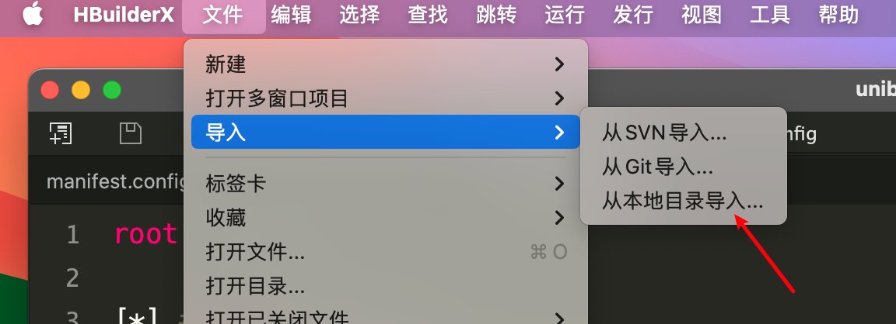
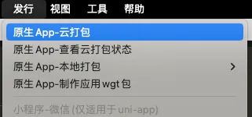
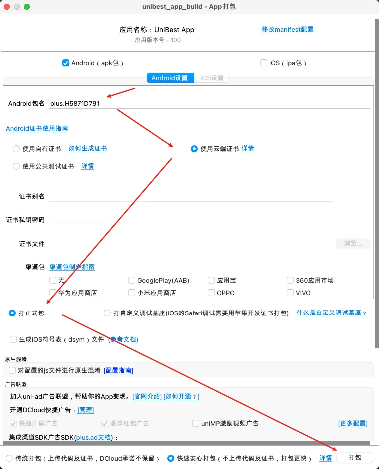

> 熟悉原生 APP 开发的开发者也可以使用 `原生APP-本地打包`。

## APP 打包注意事项（上）

很多开发者发现打包失败，或者打包白屏，这里简单说明一下。

- 1. 重新获取自己的 `AppId`

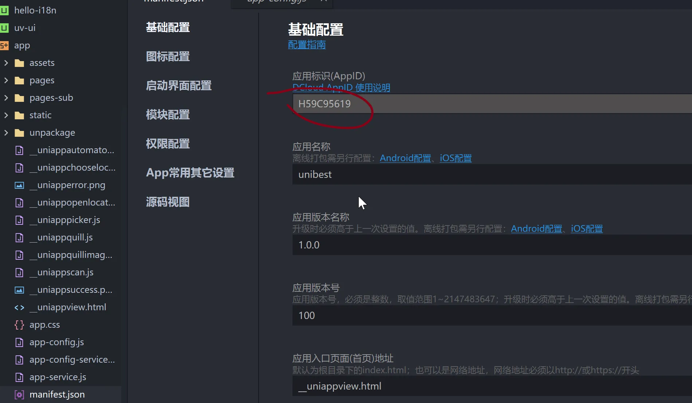

- 2. 根据上面获取到的 `AppId` 修改 `env/.env` 文件的 `VITE_UNI_APPID` 字段

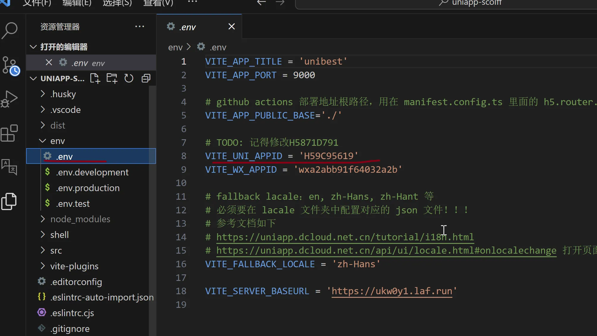

- 3. （可选）云打包如果有出现解析时出问题的，把 `minSdkVersion` 版本改低一点就好了，比如 `21`。（最低 `21`，不能低于 `21`；我模板里面设置的是 `30`）。

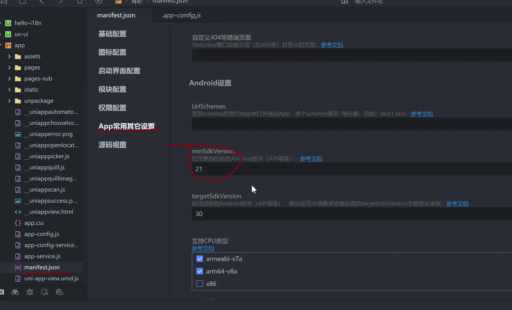

## APP 打包注意事项 （下）

### `uni-app SDK` 版本

> 特别备注：`2024-05-03`，新的 `base` 模板的 `uni-app SDK` 版本已经升级到 `4.14` 了。
>
> 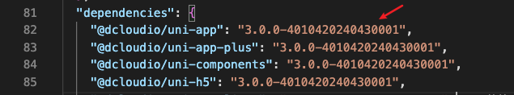

`2024-04-14`，新的 `base` 模板的 `uni-app SDK` 版本已经升级到 `4.08` ，记得更新您的 `HBuilderx` 版本。

`"@dcloudio/uni-app": "3.0.0-4000820240401001"` 表示 `uni-app` 为 `3.0.0` 版本，对应的 `HBuilderx` 版本为 `4.08`，后面的 `20240401001` 是发布日期。

> `40008` 第一个数字 `4` 表示主要版本，后面每 `2` 位数为一组，所以代表 `4.0.8`。
>
> 类似的，`30812` 代表 `3.8.12` 版本，`30909` 代表 `3.9.9` 版本。
>
> 另外，从 `3.99` 开始，后面 2 个小版本合并书写，于是 `3.9.9` 变成 `3.99`，`4.0.8` 变成 `4.08`。

`unibest` 历史用过的 `@dcloudio/uni-app` 版本：

```text
"@dcloudio/uni-app": "3.0.0-3081220230817001",  => 3.8.12
"@dcloudio/uni-app": "3.0.0-3090920231225001",  => 3.99
"@dcloudio/uni-app": "3.0.0-4000820240401001",  => 4.08
"@dcloudio/uni-app": "3.0.0-4010420240430001",  => 4.14
```

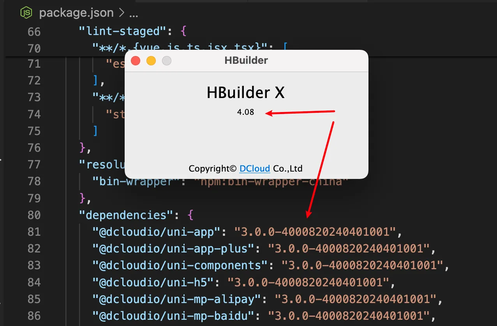

### `uni-app SDK` 版本匹配 `HBuilderX`

> 温馨提示：下面的部分是使用 `uni-app` 版本为 `3.8.12` 时写的文档，适当参考~

本模板使用的是 `3.8.12` 的库版本(`"@dcloudio/uni-app": "3.0.0-3081220230817001",`)，所以尽量使用 `3.8.12` 版本的 `HBuilderX` 来打包，否则可能有未知的风险，出现情况如下图。

> 原来的图不见了，重新补了一张。

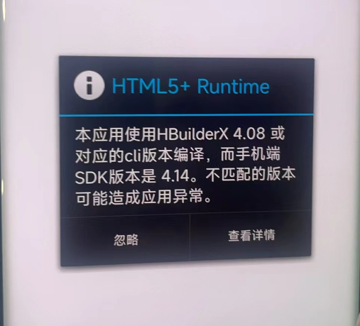

上图表示您的 `HBuilderX` 版本是 `4.08`，但是代码 `uni-app SDK` (即 `"@dcloudio/uni-app": "3.0.0-4010420240430001"` ) 是 `4.14`，版本不匹配。

- 点击 `ignore`（忽略） 后若可以正常使用，那就不用管。（可选添加如下配置）

```json
"app-plus" : { "compatible": { "ignoreVersion": true } }
```

- 如果出现白屏啥的，请更新您的 `HBuilderX` 到 `uni-app SDK` 相同版本（这里是 `4.14` ）。

### 多个 `HBuilderX` 版本安装

> 温馨提示：下面的部分是使用 `uni-app` 版本为 `3.8.12` 时写的文档，适当参考~

`MAC` 可以安装多个版本的软件，如下图我安装了 `3.8.12` (3.8.12.20230817) 和最新的 `3.99` (3.99.2023122611) 两个版本，平时的项目使用 `3.99`, 打包 `unibest` 的时候使用 `3.8.12`。

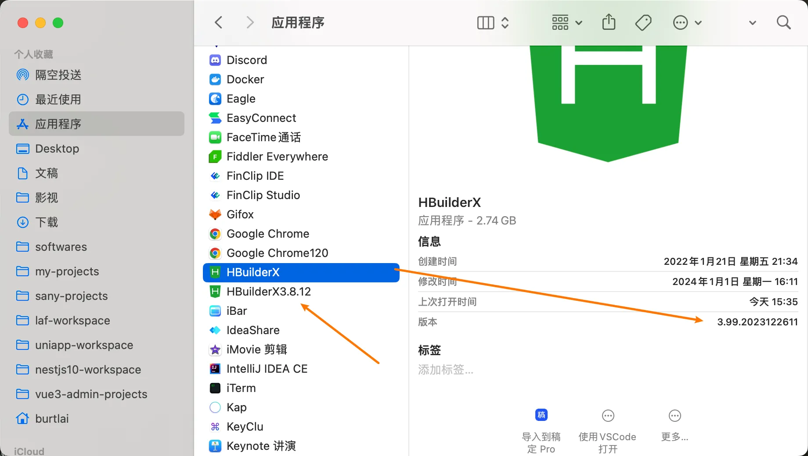

> `window` 系统也可以同时安装多个 `HBuilderX` 版本，安装时选择安装到不同目录下即可。

## 总结

本文描述了多端的运行和发布，希望对您有帮助。

全文完~
