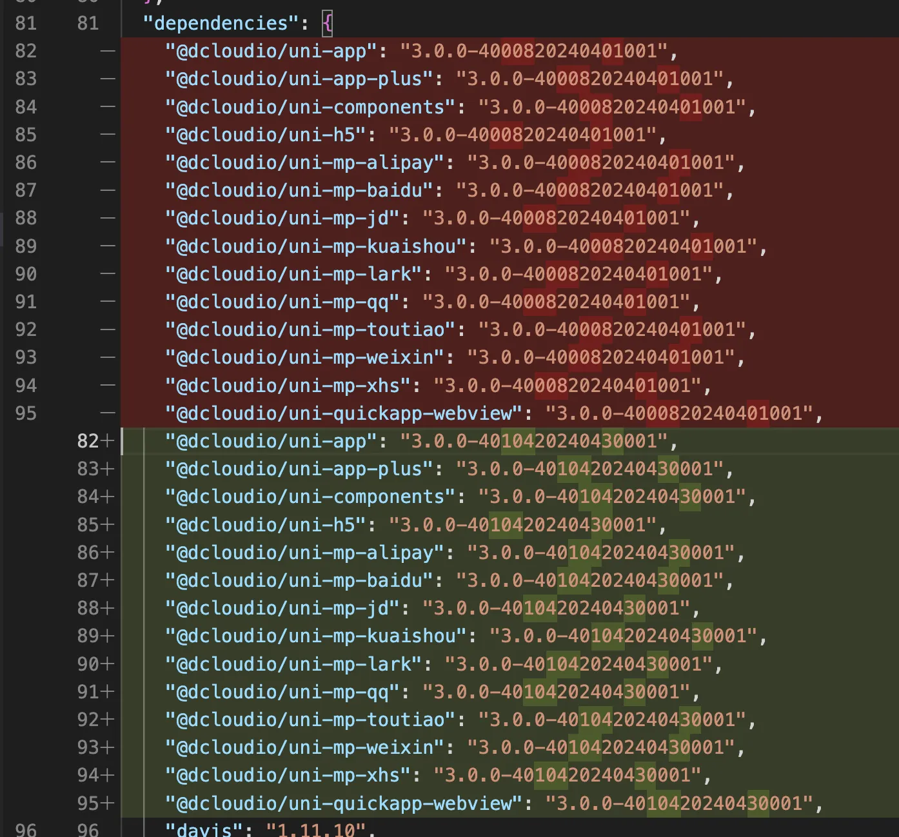
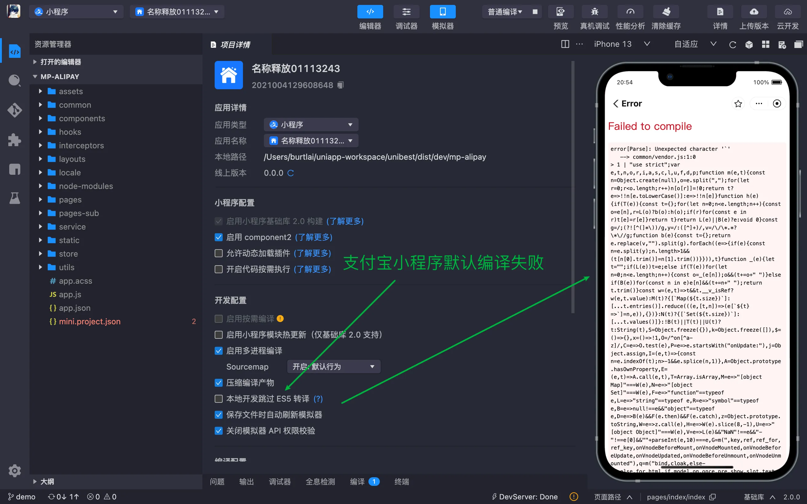
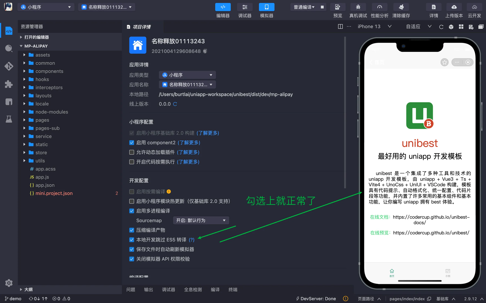
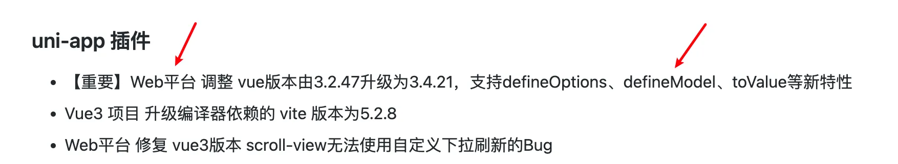
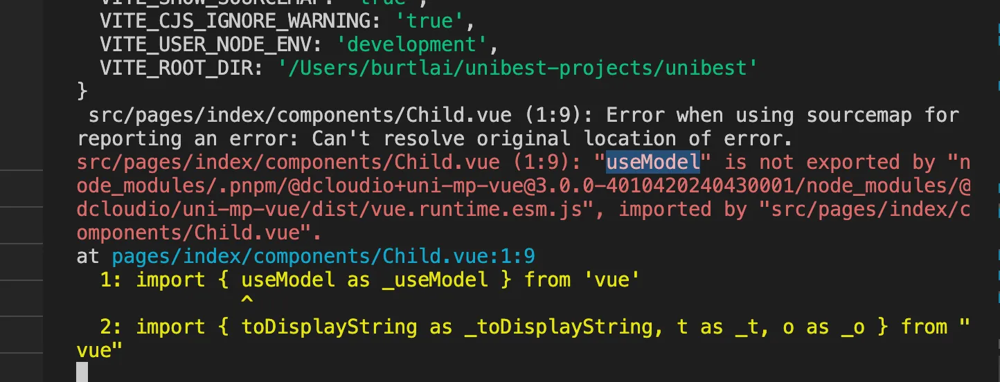
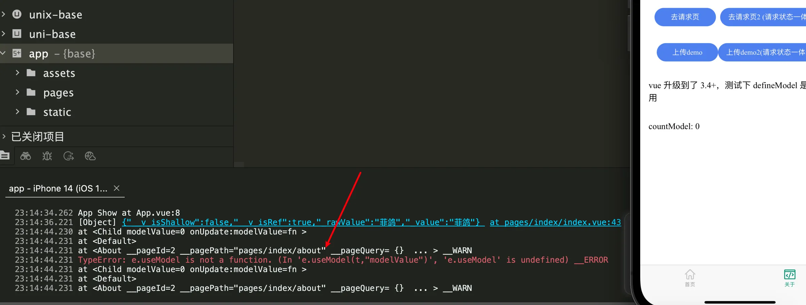

# 常见问题

本篇介绍一些常见的问题，会持续更新。

## 1. 如何设置/修改首页？

`vue` 文件的 `route-block` 块里面设置 `type="home"` 即可，请确保项目里面 `只有一个页面` 是这个配置。

> 注意：如果有多个，会按照字母顺序排列，第一个是首页。（可能不是您的想要的效果。）

## 2. 修改 `pages.json`、`manifest.json` 被覆盖问题

- `pages.json`

本项目引入了 `@uni-helper/vite-plugin-uni-pages`，`pages.json` 文件将会自动生成，手动修改 `pages.json` 将会被覆盖。

全局的东西请在 `pages.config.ts` 里面配置，页面的东西请在 `vue` 文件的 `route-block` 配置。

- `manifest.json`

与上面类似。本项目引入了 `@uni-helper/vite-plugin-uni-manifest`，`manifest.json` 文件将会自动生成，手动修改 `manifest.json` 将会被覆盖。

如需修改，请在 `manifest.config.ts` 里面修改。

## 3. 怎么分包？

`vite.config.ts` 里面有一个配置，如下：(其中 `subPackages` 就是用来分包的)

```ts [vite.config.ts]{3}
UniPages({
    exclude: ['**/components/**/**.*'],
    subPackages: ['src/pages-sub'], // 是个数组，可以配置多个
}),
```

## 4. 首次运行 `pnpm:mp` 时报错。

首次运行 `pnpm:mp` 时报错，报错如下：

```text
Error: ENOENT: no such file or directory, open '/Users/burtlai/unibest-projects/unibest/src/manifest.json'
```

首次运行 `非h5端` 时都可能出现上面的问题，需要先执行一下 `pnpm i` 以生成 `src/manifest.json` 文件，后面就不会报错了。

## 5. `git commit` 报错。

请看 `commitlint.config.ts` 里面的配置，需要满足对应的设定。根据自己的需要，可以修改 `commitlint.config.ts` 里面的配置。

如果是一次的（比如引入了某个第三方库），可以通过 `--no-verify` 参数跳过校验：

```sh
git commit -m "feat: xxx" --no-verify
```

第三方库还有另外一种处理方式，放到特定的文件夹，然后在 `.eslintignore` 和 `.styleintignore` 里面加上该文件夹。

## 6. 不想要严格的 `git` 提交检测，怎么办？

直接把 `.husky` 这个文件删掉即可。(或者不删除，只把里面的文件内容注释掉。)

## 7. `uni-app` 无法使用 `process.env` 变量，怎么办？

使用 `import.meta.env` 替代！

## 8. 如何跟随 `uni-app` 官方升级？

项目下，执行 `npx @dcloudio/uvm@latest` 即可更新。



> 注意，上面的命令会自动安装 `vue-i18n`，可以手动删除（`pnpm un vue-i18n`)，也可以不理它（没多大影响）。

## 9. 如何把已经加入 `git` 管理的文件移出 `git` 管理?

- 第一步，先把文件移出`git` 管理，操作如下：

```text
# git rm -r --cached file1 file2  ## 针对某些文件
# git rm -r --cached dir1 dir2  ## 针对某些文件夹
# git rm -r --cached .  ## 针对所有文件
```

- 第二步，提交 `commit` 以正式删除的文件

> 总结：`git rm -r --cached .` + `git commit` 即可。

## 10. 支付宝小程序运行报错。

- 默认运行是会报错的，如下图
  

- 只需要勾上 `本地开发跳过 ES5 转译` 即可正常运行，如下图
  

> 总结：勾上 `本地开发跳过 ES5 转译` 即可。

## 11. 支持 `uni-app x` 吗？

不支持。但我们一直保持关注。[uni-app x 传送门](https://doc.dcloud.net.cn/uni-app-x/)

目前 `unibest` 已经有 `hbx` 模板，后续接入 `uni-app x` 会很容易，坐等官方发布。

## 12. 为啥 `package.json` 中 `vue` 已经 `3.4+` 了，还不支持 `defineModel` ?

`uni-app` 官方虽然已经把 `vue` 升级到 `3.4+` 了，但是目前只有 `H5端` 支持 `defineModel`，其他端目前运行报错，详情请看 `uni-app` 官网的发布日志：

[HBuilder X - Release Notes](https://3085868976.hiecheimaetu.com:22443/qn-GO8xCsKgpKDZWIBAkVCUkI1EnGmQUMT4.update.dcloud.net.cn/hbuilderx/changelog/4.14.2024043013.html)

关键截图如下：（仅支持 `H5端`）



真实运行报错截图如下：（分别是 `小程序` 和 `APP`， 都会报错 ）





## 13. `base` 模板如何接 `uniCloud` ?

- 1. 操作方案：直接在原始项目目录上右键，重新识别项目类型，就可以关联 `uniCloud` 了，然后用原始项目直接运行就可以了，不需要再 `pnpm dev:app` 后导入 `dist/dev/app` 再运行了。

- 2. 问：其他模板可以吗？答：其他模板也可以，操作同上。

- 3. 我写的文章链接：[【unibest】可以去掉 hbx 模版了，base 模板一统天下](https://mp.weixin.qq.com/s?__biz=MzUxMzAwNzMwNw==&mid=2247484792&idx=1&sn=b6116198f265384e5a51bd2bd95bea90&chksm=f95a8edcce2d07caba60782e17e48d766612c0ad85c019379fd5ac37890e31b6ca7049e670f7&scene=178&cur_album_id=3438500614009782275#rd)

全文完~
