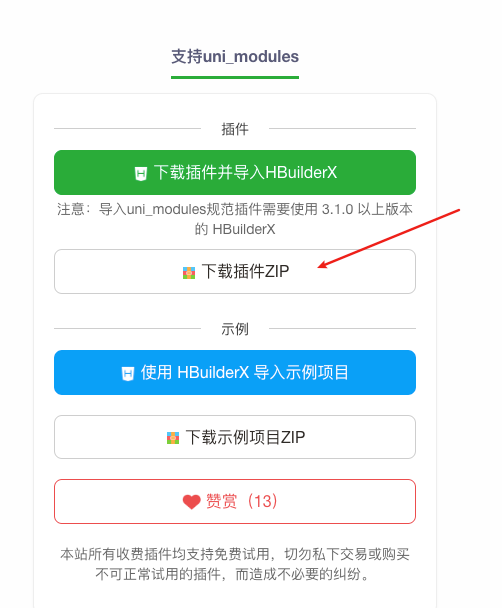
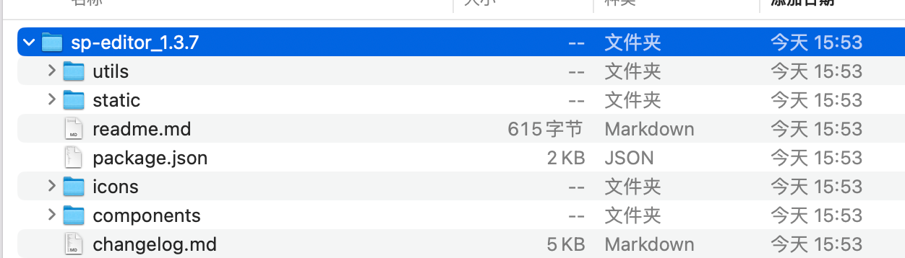
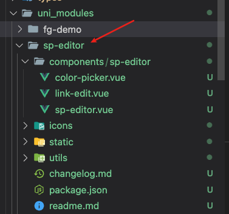
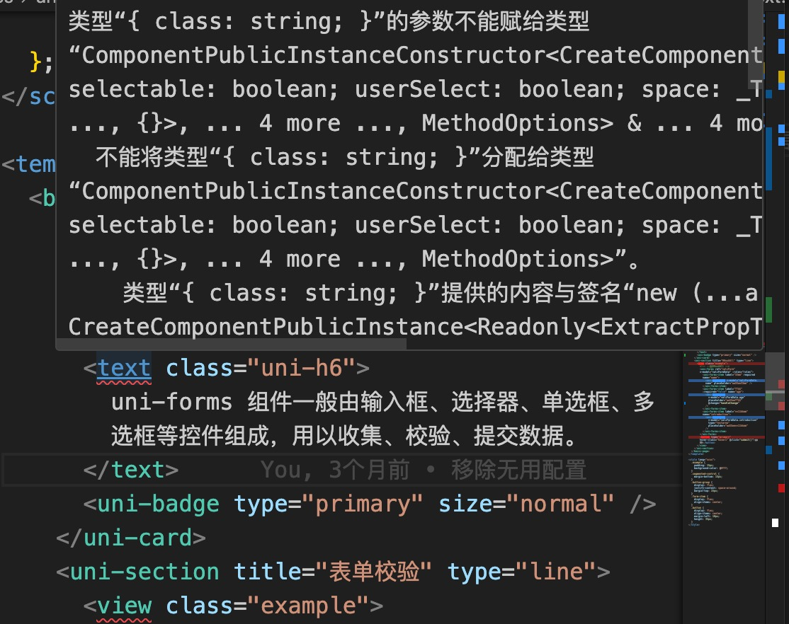
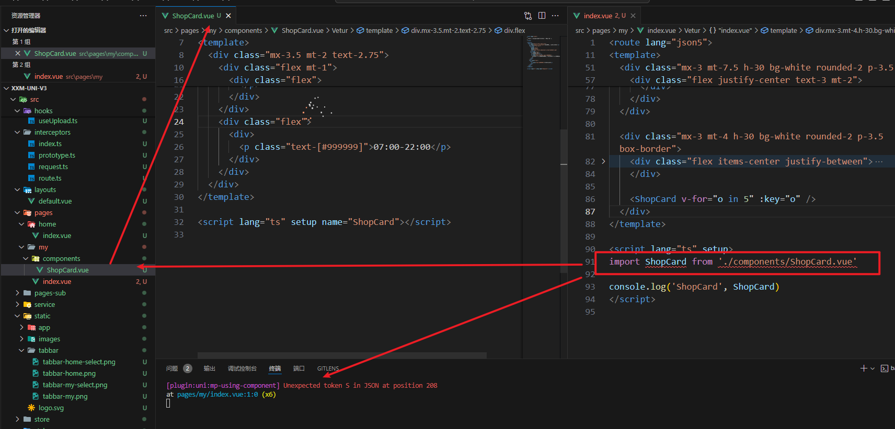
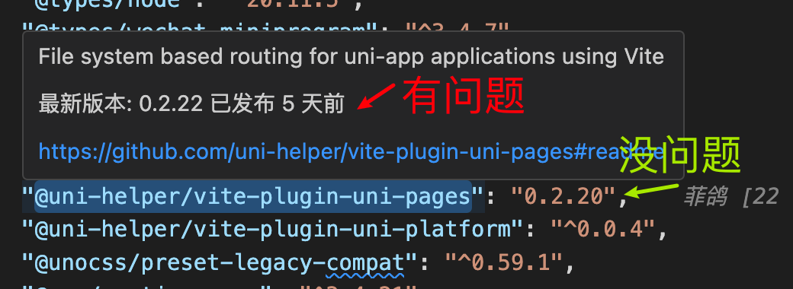

# 常见问题 2

## 1. `wot-ui` 的 `toast` + `message-box` 不生效。

- 1. `layout` 引入 `wot-ui` 的 `toast` + `message-box`。

```vue [src/layouts/default.vue]
<!-- src/layouts/default.vue -->
<template>
  <view>
    <slot />
    <wd-toast />
    <wd-message-box />
  </view>
</template>
```

> `unibest@2.1.0` 开始已经默认引入。

- 2.页面使用

```ts
import { useMessage } from 'wot-design-uni'

const message = useMessage()
const handleClick = () => {
  // 顺便测试 message 的使用
  message.show('显示隐藏切换')
}
```

## 2. `uni-app` 插件市场的插件如何使用？

`hbx` 模板可以直接引入，不在讨论范围内，下面描述的是 `普通模板`。

> 如果该插件支持 `npm` 安装，则直接安装即可，推荐统一使用 `pnpm` 安装。接着根据该插件的文档使用即可。

下面描写的是不支持 `npm` 安装的插件。

这里以 `sp-editor` 富文本插件为例，[插件地址](https://ext.dcloud.net.cn/plugin?id=14726)

- 1. 下载 `uni-app` 插件市场的代码。（居然要登录+看广告）



- 2. 解压并拷贝到 `unibest` 项目的 `uni_modules` 目录下。



- 3. 整理插件文件夹名称，把 `sp-editor_1.3.7` 改为 `sp-editor`。

> 不改会报错，因为内部代码都是用 `sp-editor` 不带版本号的。会导致查找文件失败。



- 4. 代码直接使用，无需引入组件。（ `uni-app插件` 有一套规范，`uni-app` 会自动查找，跟 `easycom` 类似。）

```html
<template>
  <view class="home">
    <view class="editor-box">
      <sp-editor
        :toolbar-config="{
          excludeKeys: ['direction', 'date', 'lineHeight', 'letterSpacing', 'listCheck'],
          iconSize: '18px',
        }"
        @init="initEditor"
        @input="inputOver"
        @upinImage="upinImage"
        @overMax="overMax"
        @addLink="addLink"
        @exportHtml="exportHtml"
      ></sp-editor>
    </view>
  </view>
</template>
```

完整版见下：
:::details

```vue
<route lang="json5">
{
  layout: 'demo',
  style: { navigationBarTitleText: '富文本' },
}
</route>

<template>
  <view class="home">
    <view class="editor-box">
      <sp-editor
        :toolbar-config="{
          excludeKeys: ['direction', 'date', 'lineHeight', 'letterSpacing', 'listCheck'],
          iconSize: '18px',
        }"
        @init="initEditor"
        @input="inputOver"
        @upinImage="upinImage"
        @overMax="overMax"
        @addLink="addLink"
        @exportHtml="exportHtml"
      ></sp-editor>
    </view>
  </view>
</template>

<script setup>
import { ref } from 'vue'

const editorIns = ref(null)

/**
 * 获取输入内容
 * @param {Object} e {html,text} 内容的html文本，和text文本
 */
function inputOver(e) {
  // 可以在此处获取到编辑器已编辑的内容
  console.log('==== inputOver :', e)
}

/**
 * 超出最大内容限制
 * @param {Object} e {html,text} 内容的html文本，和text文本
 */
function overMax(e) {
  // 若设置了最大字数限制，可在此处触发超出限制的回调
  console.log('==== overMax :', e)
}

/**
 * 编辑器就绪
 * @param {Object} editor 编辑器实例，你可以自定义调用editor实例的方法
 * @tutorial editor组件 https://uniapp.dcloud.net.cn/component/editor.html#editor-%E7%BB%84%E4%BB%B6
 * @tutorial 相关api https://uniapp.dcloud.net.cn/api/media/editor-context.html
 */
function initEditor(editor) {
  editorIns.value = editor // 保存编辑器实例
  // 保存编辑器实例后，可以在此处获取后端数据，并赋值给编辑器初始化内容
  preRender()
}

function preRender() {
  setTimeout(() => {
    // 异步获取后端数据后，初始化编辑器内容
    editorIns.value.setContents({
      html: `<div>&nbsp;&nbsp;猫猫</div>`,
    })
  }, 1000)
}

/**
 * 直接运行示例工程插入图片无法正常显示的看这里
 * 因为插件默认采用云端存储图片的方式
 * 以$emit('upinImage', tempFiles, this.editorCtx)的方式回调
 * @param {Object} tempFiles
 * @param {Object} editorCtx
 */
function upinImage(tempFiles, editorCtx) {
  /**
   * 本地临时插入图片预览
   * 注意：这里仅是示例本地图片预览，因为需要将图片先上传到云端，再将图片插入到编辑器中
   * 正式开发时，还请将此处注释，并解开下面 使用 uniCloud.uploadFile 上传图片的示例方法 的注释
   * @tutorial https://uniapp.dcloud.net.cn/api/media/editor-context.html#editorcontext-insertimage
   */
  // #ifdef MP-WEIXIN
  // 注意微信小程序的图片路径是在tempFilePath字段中
  editorCtx.insertImage({
    src: tempFiles[0].tempFilePath,
    width: '80%', // 默认不建议铺满宽度100%，预留一点空隙以便用户编辑
    success: function () {},
  })
  // #endif

  // #ifndef MP-WEIXIN
  editorCtx.insertImage({
    src: tempFiles[0].path,
    width: '80%', // 默认不建议铺满宽度100%，预留一点空隙以便用户编辑
    success: function () {},
  })
  // #endif

  /**
   * 使用 uniCloud.uploadFile 上传图片的示例方法（可适用多选上传）
   * 正式开发环境中，请将上面 本地临时插入图片预览 注释后，模仿以下写法
   */
  // tempFiles.forEach(async (item) => {
  //   uni.showLoading({
  //     title: '上传中请稍后',
  //     mask: true
  //   })
  //   let upfile = await uniCloud.uploadFile({
  //     filePath: item.path,
  //     // 同名会导致报错 policy_does_not_allow_file_overwrite
  //     // cloudPath可由 想要存储的文件夹/文件名 拼接，若不拼文件夹名则默认存储在cloudstorage文件夹中
  //     cloudPath: `cloudstorage/${item.name}`,
  //     cloudPathAsRealPath: true
  //   })
  //   editorCtx.insertImage({
  //     src: upfile.fileID,
  //     width: '80%', // 默认不建议铺满宽度100%，预留一点空隙以便用户编辑
  //     success: function () {
  //       uni.hideLoading()
  //     }
  //   })
  // })
}

/**
 * 导出 - toolbar需要开启export工具
 * @param {string} e 导出的html内容
 */
function exportHtml(e) {
  uni.navigateTo({
    url: '/pages/out/out',
    success(res) {
      // 传至导出页面解析即可
      res.eventChannel.emit('e-transmit-html', {
        data: e,
      })
    },
  })
}

/**
 * 添加超链接
 * @param {Object} e { text: '链接描述', href: '链接地址' }
 */
function addLink(e) {
  console.log('==== addLink :', e)
}
</script>
```

:::

## 3. Vue - Official 使用哪个版本？

~~使用 `1.8x`，而不是 `2.x`~~，否则出现下面这样的问题：

> 最新的 `v2.1.10` 已经可以了，直接安装即可.



## 4. 为啥不用 `vant-ui`？

`vant-ui` 是 `WEB` 端 `UI 库`，不适用于 `uni-app`。

`uni-app` 没有 `window`, `document` 等 `WEB API`，所以凡是使用 `WEB API` 的 `框架`、`UI 库` 等都不适用于 `uni-app`。

## 4. 控制台报错 `[plugin:uni:mp-using-component] Unexpected token S in JSON at position 208`。

控制台报错如下：


原因是 `uni-pages` 这个插件最新版本 `0.2.22` 有问题，需要回退到 `0.2.20`。



执行如下命令即可：

```
pnpm add @uni-helper/vite-plugin-uni-pages@0.2.20
```

> 因为 `unibest` 在 `2.3.0（含）` 之前没有把 `pnpm-lock.yaml` 加入到版本管理，导致小版还是有细微差别。
>
> 在 `2.4.0` 开始已经加入，不会再出现这个问题。

## 5.不会 TypeScript 怎么办

不管个人还是团队、产品或者项目，从长远考虑我们都建议你学习 TypeScript，因为它是未来的趋势，而且大部分框架、库、插件都是用 TypeScript 开发的，足以证明它是构建一款成熟稳健产品的基石。

但考虑到实际情况，会各种客观原因存在，如果必须要用传统 JavaScript 进行开发，你可以在 `tsconfig.json` 里将 `allowJs` 设置为 `true` 即可，框架原有的 TypeScript 代码不会受到影响，并且你也可以在项目中使用 JavaScript 编写代码。

## 6.微信小程序 `INVALID_LOGIN`

微信小程序开发进入登录页时，可能导致如下问题：

```text
{errMsg: "navigateTo:fail Error: INVALID_LOGIN,
access_token expired [20250103 17:08:03][touristappid]"}
```

> 解答：游客模式会出现该错误，微信扫码登录一下就可以了。
