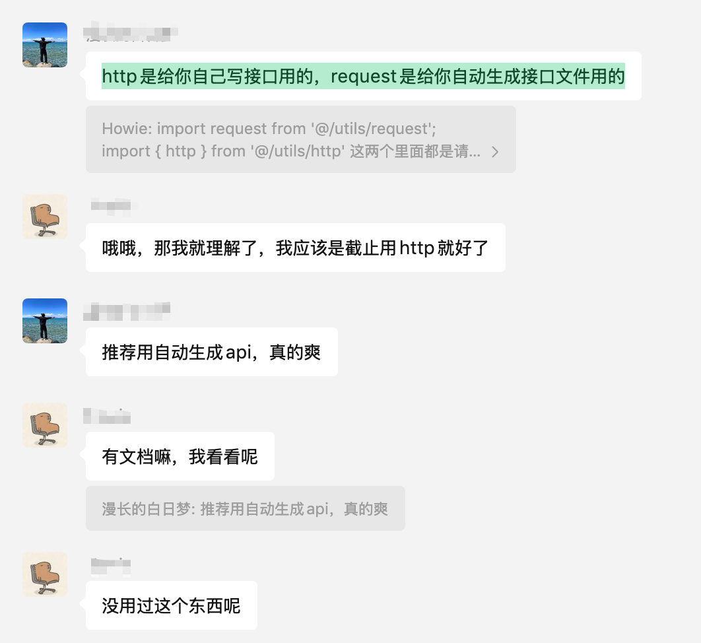

# 自动生成代码



集成 [openapi-ts-request](https://github.com/openapi-ui/openapi-ts-request) 插件，可以根据接口文档自动生成 js,ts,uni.request,vue-query 代码。

> 好用的话记得点赞，`star` 支持下。

支持 apifox/swagger/opeanpi/yapi 等接口文档，更多配置详情请查看 [openapi-ts-request](https://github.com/openapi-ui/openapi-ts-request) 插件。

## 如何使用

你只需要将接口文档对应的接口配置url，复制到根目录的 `openapi-ts-request.config.ts` 插件的配置文件中的 `schemaPath` 字段中，然后运行 `npm run openapi-ts-request` 命令，就可以生成代码。
支持同时配置多个接口文档url，生成的代码默认会放在 `src/service/app` 目录下，你可以自己调整生成代码的目录。

配置如下：

```ts
import type { GenerateServiceProps } from 'openapi-ts-request'

export default [
  {
    schemaPath: 'http://petstore.swagger.io/v2/swagger.json',
    serversPath: './src/service/app',
    requestLibPath: `import request from '@/utils/request';\n import { CustomRequestOptions } from '@/interceptors/request';`,
    requestOptionsType: 'CustomRequestOptions',
    isGenReactQuery: true,
    reactQueryMode: 'vue',
    isGenJavaScript: false,
  },
] as GenerateServiceProps[]
```

## 生成 ts 代码

ts 的 type 类型会默认生成在 `src/service/app/types.ts` 文件，你可以通过引入它们进行使用。

```ts
import { type Category } from '@/service/app'

const category: Category = {
  id: 1,
  name: '张三',
}
```

## 生成 uni.request 代码

ts 的 uni.request 客户端会默认生成在 `src/service/app` 目录下，以模块名进行分类，你可以通过引入它们进行使用。

```ts
import { getPetById } from '@/service/app'

onShow(() => {
  const res = await getPetById({ id: 1 })
  console.log('res: ', res)
})
```

## 生成 vue-query 代码

vue-query 的代码会默认生成在 `src/service/app` 目录下，以模块名进行分类，后缀为 `moduleName.vuequery.ts`，你可以通过引入它们进行使用。

```ts
import { useQuery } from '@tanstack/vue-query'
import { findPetsByStatusQueryOptions, usePlaceOrderMutation } from '@/service/app'

// get请求使用，findPetsByStatusQueryOptions 方法为自动生成 react-query 函数
export function findPetsByStatusQueryOptions(options: {
  // 叠加生成的Param类型 (非body参数openapi默认没有生成对象)
  params: API.findPetsByStatusParams;
  options?: CustomRequestOptions;
}) {
  return queryOptions({
    queryFn: async ({ queryKey }) => {
      return apis.findPetsByStatus(queryKey[1] as typeof options);
    },
    queryKey: ['findPetsByStatus', options],
  });
}

// vue-query useQuery 默认使用
const {
  data,
  error
  isLoading,
  refetch,
} = useQuery(findPetsByStatusQueryOptions({ params: { status: ['available'] } }))

// vue-query useQuery 额外配置
const {
  data,
  error
  isLoading,
  refetch,
} = useQuery({
  ...findPetsByStatusQueryOptions({ params: { status: ['available'] } }),
  enabled: !!token,
})

// post, delete, patch请求使用，usePlaceOrderMutation 为自动生成 vue-query hook函数
export function usePlaceOrderMutation(options?: {
  onSuccess?: (value?: API.Order) => void;
  onError?: (error?: DefaultError) => void;
}) {
  const { onSuccess, onError } = options || {};

  const response = useMutation({
    mutationFn: apis.placeOrder,
    onSuccess(data: API.Order) {
      onSuccess?.(data);
    },
    onError(error) {
      onError?.(error);
    },
  });

  return response;
}

// 定义请求
const { mutate, isPending } = usePlaceOrderMutation({
  onSuccess: (data) => {
    console.log('success data: ', data)
  },
})

// 提交请求
mutate({
  body: {
    status: 'placed',
    complete: true,
  }
})
```
