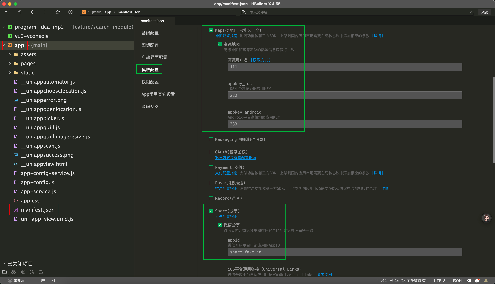
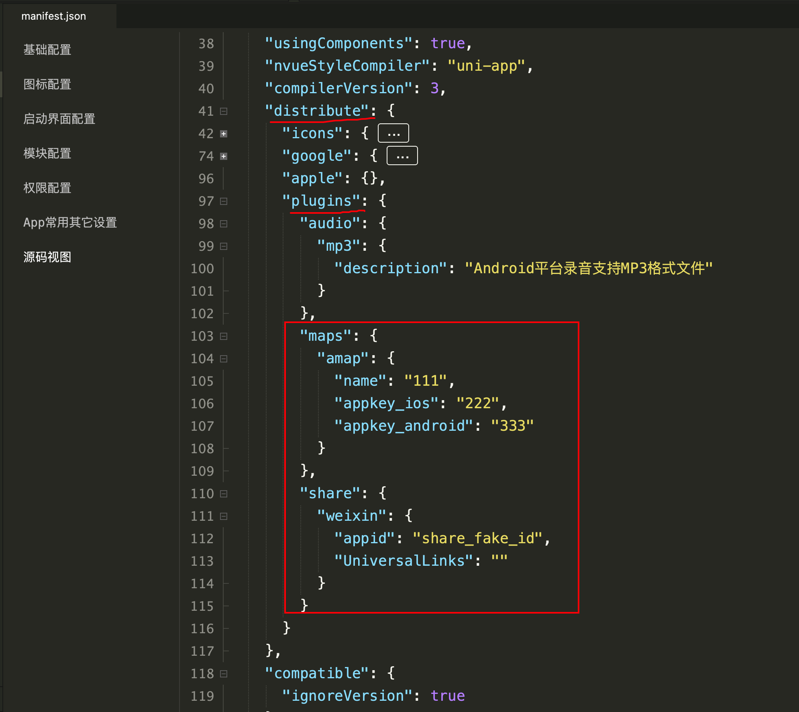

# App 专题

## manifest.json的内容搬运到 manifest.config.ts

我们默认的的 `manifest.config.ts` 只包含了比较基础的 `uniapp` 配置，有的时候我们需要在打包 `app` 时在 `hbuilderx` 里面额外设置一些配置，那么就需要配置好后把 `manifest.json` 中的内容拷贝到 `manifest.config.ts` 中，后面运行就不会丢失了。

举例子，我在 `manifest.json` 里面配置了 2个模块配置，如下：

点击左侧下面的 `源码视图` 就可以看到增加了如下内容：

只需要把对应的内容拷贝到 `manifest.config.ts` 中的 `distribute.plugins` 里面即可。
