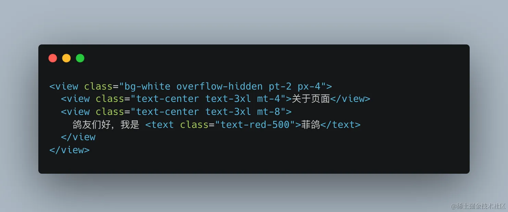
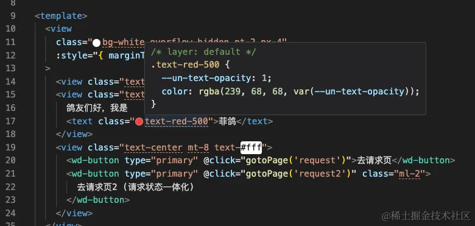
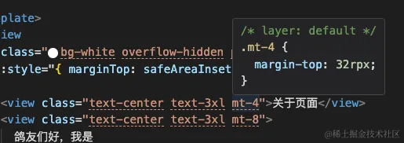
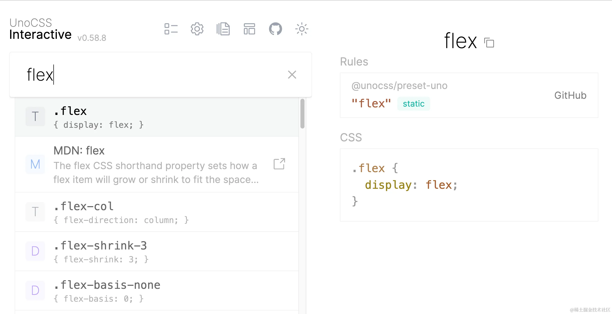
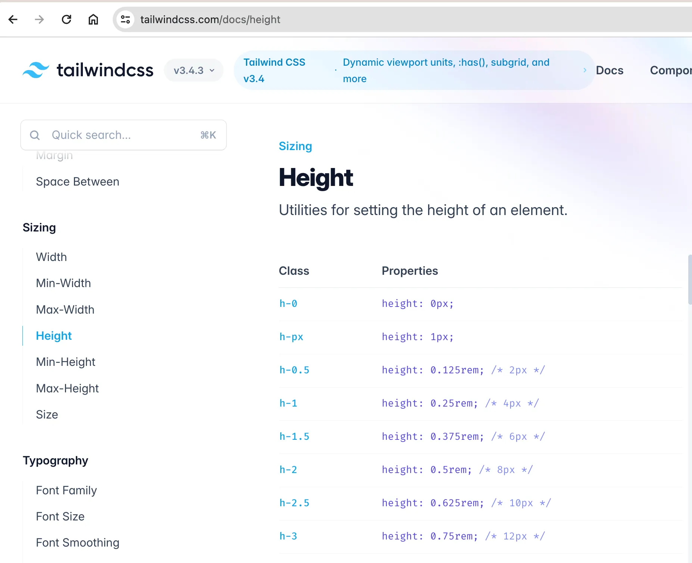

# 样式篇

本篇主要介绍 `UnoCSS` 的使用，以及如何与 `设计稿尺寸` 对应。

## UnoCSS

[UnoCSS](https://unocss.dev/) 是按需使用的原子 CSS 引擎，提供了良好的样式支持。



在 VSCode 中还可以预览，





> 如果原子化 `UnoCSS` 没有预览效果，请安装 `VSCode` 插件 `antfu.unocss`。

如果不记得原子类，可以查 `UnoCSS 的原子类`，[UnoCSS Interactive](https://unocss.dev/interactive/)，如下图


也可以查看 `tailwindcss` 的原子类，更加清晰明了，[链接 - tailwindcss](https://tailwindcss.com/)，如下图：



## 常用的原子类

- 宽高内外边距： `w-2`, `h-4`, `px-6`, `mt-8`等
- 前景色背景色：`text-green-400`, `bg-green-500`
- border: `border-2`, `border-solid`, `border-green-600`, `b-r-2` (注意 `border` = `border-1`，就是说边框 `1px` 时，一般简写为 `border` )
- border-radius: `rounded-full`, `rounded-6`, `rounded-sm` (不是 `br-10`, 也不是 `b-r-10`)
- line-height: `leading-10` (不是 `l-10`, 也不是 `lh-10`)
- hover: `hover:text-green-200`, `hover:bg-green-300`, `hover:border-dashed`
- flex: `flex`, `items-center`, `justify-center`, `flex-1`

## `UnoCSS` 配置

下面内容选读：

:::details
`unocss.config.ts` 文件内容如下：

```ts
// uno.config.ts
import {
  type Preset,
  defineConfig,
  presetUno,
  presetAttributify,
  presetIcons,
  transformerDirectives,
  transformerVariantGroup,
} from 'unocss'

import { presetApplet, presetRemRpx, transformerAttributify } from 'unocss-applet'

// @see https://unocss.dev/presets/legacy-compat
import { presetLegacyCompat } from '@unocss/preset-legacy-compat'

const isMp = process.env?.UNI_PLATFORM?.startsWith('mp') ?? false

const presets: Preset[] = []
if (isMp) {
  // 使用小程序预设
  presets.push(presetApplet(), presetRemRpx())
} else {
  presets.push(
    // 非小程序用官方预设
    presetUno(),
    // 支持css class属性化
    presetAttributify(),
  )
}
export default defineConfig({
  presets: [
    ...presets,
    // 支持图标，需要搭配图标库，eg: @iconify-json/carbon, 使用 `<button class="i-carbon-sun dark:i-carbon-moon" />`
    presetIcons({
      scale: 1.2,
      warn: true,
      extraProperties: {
        display: 'inline-block',
        'vertical-align': 'middle',
      },
    }),
    // 将颜色函数 (rgb()和hsl()) 从空格分隔转换为逗号分隔，更好的兼容性app端，example：
    // `rgb(255 0 0)` -> `rgb(255, 0, 0)`
    // `rgba(255 0 0 / 0.5)` -> `rgba(255, 0, 0, 0.5)`
    presetLegacyCompat({
      commaStyleColorFunction: true,
    }) as Preset,
  ],
  /**
   * 自定义快捷语句
   * @see https://github.com/unocss/unocss#shortcuts
   */
  shortcuts: [['center', 'flex justify-center items-center']],
  transformers: [
    // 启用 @apply 功能
    transformerDirectives(),
    // 启用 () 分组功能
    // 支持css class组合，eg: `<div class="hover:(bg-gray-400 font-medium) font-(light mono)">测试 unocss</div>`
    transformerVariantGroup(),
    // Don't change the following order
    transformerAttributify({
      // 解决与第三方框架样式冲突问题
      prefixedOnly: true,
      prefix: 'fg',
    }),
  ],
  rules: [
    [
      'p-safe',
      {
        padding:
          'env(safe-area-inset-top) env(safe-area-inset-right) env(safe-area-inset-bottom) env(safe-area-inset-left)',
      },
    ],
    ['pt-safe', { 'padding-top': 'env(safe-area-inset-top)' }],
    ['pb-safe', { 'padding-bottom': 'env(safe-area-inset-bottom)' }],
  ],
})

/**
 * 最终这一套组合下来会得到：
 * mp 里面：mt-4 => margin-top: 32rpx  == 16px
 * h5 里面：mt-4 => margin-top: 1rem == 16px
 *
 * 另外，我们还可以推算出 UnoCSS 单位与设计稿差别4倍。
 * 375 * 4 = 1500，把设计稿设置为1500，那么设计稿里多少px，unocss就写多少述职。
 * 举个例子，设计稿显示某元素宽度100px，就写w-100即可。
 *
 * 如果是传统方式写样式，则推荐设计稿设置为 750，这样设计稿1px，代码写1rpx。
 * rpx是响应式的，可以让不同设备的屏幕显示效果保持一致。
 */
```

### UnoCSS presets

主要有 `4`个：

- `presetUno` —— `UnoCSS` 默认的预设，`H5端` 适用，`非H5端` 不支持，代码已经作区别处理。
- `presetApplet` 小程序预设，因为默认 `Unocss 预设` 是针对 `WEB` 的，如果不加以处理，会报错，比如小程序不支持 `*`， 没有 `body` 等。该预设同样对 `APP` 生效。
- `presetIcons`，专门使用 `UnoCSS Icons` 的，需要搭配图标库使用，eg: `@iconify-json/carbon`, 代码编写如 `<button class="i-carbon-sun dark:i-carbon-moon" />`
- `presetLegacyCompat` 针对低端 `APP` 不认识新的函数颜色的兼容性预设，可以将颜色函数 `rgb()和hsl()` 里面空格分隔转换为逗号分隔，更好的兼容性`APP`端，example：
  > `rgb(255 0 0)` -> `rgb(255, 0, 0)`
  >
  > `rgba(255 0 0 / 0.5)` -> `rgba(255, 0, 0, 0.5)`

### UnoCSS shortcuts

```ts
/**
* 自定义快捷语句
* @see https://github.com/unocss/unocss#shortcuts
*/
shortcuts: [['center', 'flex justify-center items-center']],
```

可以编写一些常用的快捷类名，如上表示 `center` 就是 `flex justify-center items-center` 的组合，合理的添加快捷类名可以加快样式编写。

:::

## 设计稿尺寸

不同的编写方式，需要设置不同的设计稿尺寸，请看下文：

### 1. 传统编写方式

如果有设计稿，通常使用传统的编写 `CSS` 的方式，里面的对应尺寸规律如下。以蓝湖为例，假如设计稿宽度为 `750px`，则直接复制样式代码到 css 代码，同时把 `px` 批量替换为 `rpx` 即可。

如果设计稿不是 `750px` 可以调整蓝湖的设置，让设计稿宽度为 `750px`。

> 下面为一段辅助说明文案，从 `uniapp` 官网搬运而来。

`rpx` 是相对于基准宽度的单位，可以根据屏幕宽度进行自适应。`uni-app` 规定屏幕基准宽度 `750rpx`。

开发者可以通过设计稿基准宽度计算页面元素 `rpx` 值，设计稿 `1px` 与框架样式 `1rpx` 转换公式如下：

`设计稿 1px / 设计稿基准宽度 = 框架样式 1rpx / 750rpx`

换言之，页面元素宽度在 `uni-app` 中的宽度计算公式：

`750 * 元素在设计稿中的宽度 / 设计稿基准宽度`

举例说明：

若设计稿宽度为 `750px`，元素 `A` 在设计稿上的宽度为 `100px`，那么元素 `A` 在 `uni-app` 里面的宽度应该设为：`750 * 100 / 750`，结果为：`100rpx`。

若设计稿宽度为 `640px`，元素 `A` 在设计稿上的宽度为 `100px`，那么元素 `A` 在 `uni-app` 里面的宽度应该设为：`750 * 100 / 640`，结果为：`117rpx`。

若设计稿宽度为 `375px`，元素 `B` 在设计稿上的宽度为 `200px`，那么元素 `B` 在 `uni-app` 里面的宽度应该设为：`750 * 200 / 375`，结果为：`400rpx`。

### 2. UnoCSS 编写方式

经过上一节的 `unocss.config.ts` 配置，可以得到下面的组合：

> mp 里面：mt-4 => margin-top: 32rpx == 16px
>
> h5 里面：mt-4 => margin-top: 1rem == 16px

我们还是把设计稿设置为 `750`，设计稿上多少 `px` 的元素，写成多少 `rpx` 即可。

元素 `A` 在设计稿上的宽度为 `100px`，则写 `w-100rpx` 即可。

就是把 `传统编写方式` 中写在 `css` 中的样式搬到了 `UnoCSS` 中。

如果要想用 `w-100` 这种方式，需要做额外的处理（待验证）：

:::details
太忙了，有空再写吧。
:::

## 总结

本文主要介绍了 `UnoCSS` 的使用，以及 `unocss.config.ts` 中的一些配置项。

同时说明了设计稿在两种编写方式下的宽度的设置，分别为 `750` 和 `1500`.

最后说明一下，`原子化CSS` 和 `传统方式` 两者不是互斥的，他们是互补的，合适的地方使用合适的方式。
