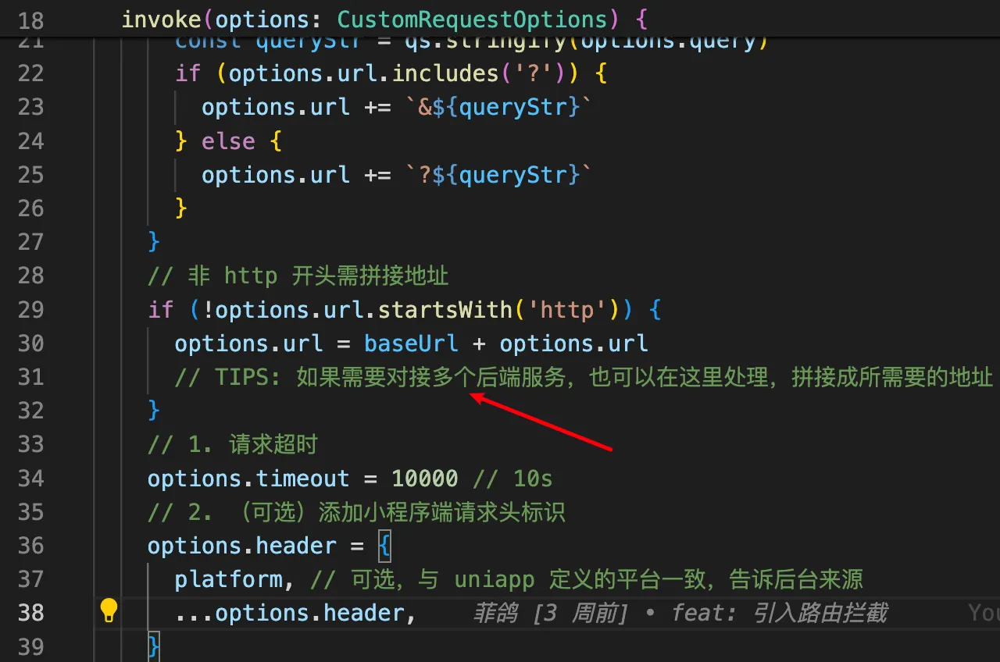

# 请求篇

本篇分为三块内容：

- 普通请求
- 图片上传
- 多后台地址

## 普通请求

普通请求分 2 种处理，一种是只在页面请求一次的一次性请求，这种请求占大多数；一种是项目多处用到的请求，这种请求占小部分，需要单独编写一个请求函数放到 `api文件夹` or `service文件夹`。

> `unibest` 里面是使用 `service文件夹` 后面不再说明。

下面来分别演示：

### 一次性请求

`template` 部分编码如下:

```html
<template>
  <button @click="run">请求</button>
  <view v-if="loading" class="text-blue h-10">请求中...</view>
  <view v-if="error" class="text-red h-10">请求错误</view>
  <view v-else class="text-green h-10">{{ JSON.stringify(data) }}</view>
</template>
```

`script` 部分使用 `菲鸽` 封装好的 `useRequest` 即可实现请求状态一体化，如下：

```ts
<script setup>
type IFooItem = { name: string }
const { loading, error, data, run } = useRequest<IFooItem>(() => httpGet('/foo', { name: '菲鸽' }))
</script>
```

看吧，使用非常简单。

### 重复性请求

`重复性请求` 与 `一次性请求` 的 `html部分` 是一样的，唯一的区别是 `请求函数` 放到了 `service文件夹`，如下所示：

```ts
<script setup>
import { getFooAPI, IFooItem } from '@/service/index/foo' // 看这里
const { loading, error, data, run } = useRequest<IFooItem>(() => getFooAPI('菲鸽'))
</script>
```

对应的 `src/service/index/foo.ts` 文件如下：

```ts
import { http, httpGet } from '@/utils/http'
export interface IFooItem {
  id: string
  name: string
}

/** GET 请求 */
export const getFooAPI = (name: string) => {
  return http<IFooItem>({
    url: `/foo`,
    method: 'GET',
    query: { name },
  })
}

/** GET 请求 - 再次简化，看大家是否喜欢这种简化 */
export const getFooAPI2 = (name: string) => {
  return httpGet<IFooItem>('/foo', { name })
}
```

依然非常简洁，深受妹子喜爱。

> 完成范例如下

```ts
/** GET 请求 */
export const getFooAPI = (name: string) => {
  return http.get<IFooItem>('/foo', { name })
}
/** GET 请求；支持 传递 header 的范例 */
export const getFooAPI2 = (name: string) => {
  return http.get<IFooItem>('/foo', { name }, { 'Content-Type-100': '100' })
}

/** POST 请求 */
export const postFooAPI = (name: string) => {
  return http.post<IFooItem>('/foo', { name })
}
/** POST 请求；需要传递 query 参数的范例；微信小程序经常有同时需要query参数和body参数的场景 */
export const postFooAPI2 = (name: string) => {
  return http.post<IFooItem>('/foo', { name })
}
/** POST 请求；支持 传递 header 的范例 */
export const postFooAPI3 = (name: string) => {
  return http.post<IFooItem>('/foo', { name }, { name }, { 'Content-Type-100': '100' })
}
```

## 图片上传

`template` 部分编码如下:

```html
<template>
  <view class="p-4 text-center">
    <wd-button @click="run">选择图片并上传</wd-button>
    <view v-if="loading" class="text-blue h-10">上传...</view>
    <template v-else>
      <view class="m-2">上传后返回的图片地址：</view>
      <view class="m-2">{{ data }}</view>
      <view class="h-80 w-full">
        <image v-if="data" :src="data" mode="scaleToFill" />
      </view>
    </template>
  </view>
</template>
```

`script` 部分使用 `菲鸽` 封装好的 `useUpload` 即可实现请求状态一体化，如下：

```ts
<script lang="ts" setup>
const { loading, data, run } = useUpload<string>({ user: '菲鸽' })
</script>
```

使用非常简单，深受汉子和妹子的喜爱。

## 多后台地址

上面的 `普通请求` 默认是只有一个请求地址的，在 `.env` 里面配置 `VITE_SERVER_BASEURL`，如下：

```text
VITE_SERVER_BASEURL = 'https://ukw0y1.laf.run'
```

并且在 `src/interceptors/request.ts` 里面有设置：

- 如果是 `http` 开头的请求路径，则直接请求
- 如果不是，则拼接上 `VITE_SERVER_BASEURL`



但在多后台地址时就不能这么玩了，需要处理如下：（关注上图的箭头部分）

```ts
// 可以写一个映射对象，如：
const proxyMap = {
  cms:'http://localhost:8080/cms',
  ums:'http://localhost:8080/ums',
}

// 拦截器部分（上图箭头部分）修改如下
Object.keys(proxyMap).forEach(key=>{
  if(options.url.startsWith(`/${key}`)){
    options.url = proxyMap[key] + options.url
  }
}

// 接口调用的地方使用如下格式：
export const getFooAPI = (name: string) => {
  return http<IFooItem>({
    url: `/cms/foo`, // 看这里，前缀不用！！！
    method: 'GET',
    query: { name },
  })
}
```

## 支持header传递

目前（v2.6.2）已经支持 `header` 了，具体使用方法如下：(最后一个参数就是 `header`，不需要不用传，需要才传。)

```ts
/** GET 请求 */
export const getFooAPI = (name: string) => {
  return http.get<IFooItem>('/foo', { name }, { 'Content-Type': 'multipart/form-data' })
}

/** POST 请求 */
export const postFooAPI = (name: string) => {
  return http.post<IFooItem>('/foo', { name }, { name }, { 'Content-Type': 'multipart/form-data' })
}
```

低于v2.6.2版本，需要手动设置header，具体使用方法如下：(`utils/http.ts`)

```diff
/**
 * GET 请求
 * @param url 后台地址
 * @param query 请求query参数
+ * @param header 请求头，默认为json格式
 * @returns
 */
export const httpGet = <T>(
  url: string,
  query?: Record<string, any>,
+  header?: Record<string, any>,
) => {
  return http<T>({
    url,
    query,
    method: 'GET',
+    header,
  })
}

/**
 * POST 请求
 * @param url 后台地址
 * @param data 请求body参数
 * @param query 请求query参数，post请求也支持query，很多微信接口都需要
+ * @param header 请求头，默认为json格式
 * @returns
 */
export const httpPost = <T>(
  url: string,
  data?: Record<string, any>,
  query?: Record<string, any>,
+  header?: Record<string, any>,
) => {
  return http<T>({
    url,
    query,
    data,
    method: 'POST',
+    header,
  })
}
```

## 环境变量配置

- `普通请求` 需要在 `.env` 里面配置 `VITE_SERVER_BASEURL`，用在 `src/interceptors/request.ts` 文件拼接请求地址；而 `多后台地址` 时则用不上，可以删除。

```text
VITE_SERVER_BASEURL = 'https://ukw0y1.laf.run'
```

- `图片上传` 需要在 `.env` 里面配置 `VITE_UPLOAD_BASEURL`:

```text
VITE_UPLOAD_BASEURL = 'https://ukw0y1.laf.run/upload'
```

全文完~
