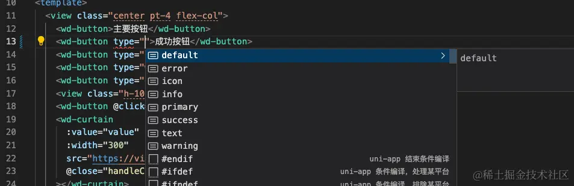
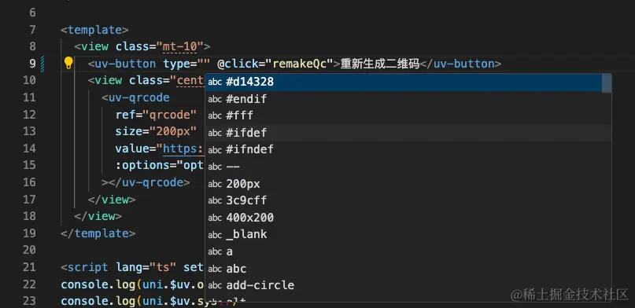
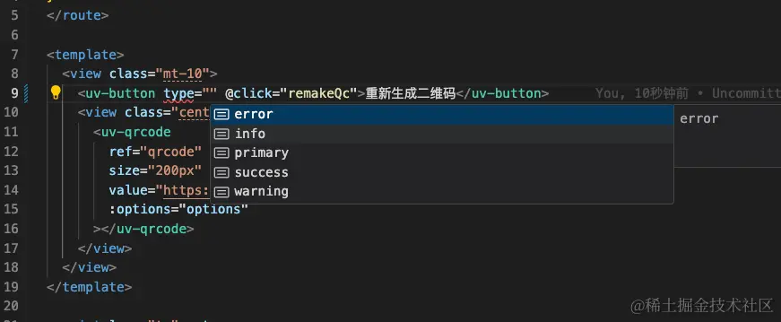

# UI 库选型篇

## 背景

`unibest` 作为最好的 `uniapp` 开发模板，那 `UI 框架` 的选择也是要仔细斟酌的。

`unibest` 作为 `vue3` 项目，`vue2` 时代的 `uview` 就不考虑在内了。但是在 `uview` 的基础上衍生出来的支持 `vue3` 的 `uview 系` 的 `ui框架` 还有不少，而且热度很高。

官方维护的 `uni-ui`，支持全端，而且有类型提示，但样式略丑，且其他优秀的 `UI 库` 已经包含了 `uni-ui` 的组件，所以直接用第三方 `UI 库` 就好了。

> tip1: `uni-ui` 本身是 `js` 开发的，但是官方提供了完备的类型提示( by `@uni-helper/uni-ui-types`)所以看起来就像是 `ts` 开发的一样，开发体验很好。所有的组件都有提示，很方便，很贴心。

> tip2: 再次重申一下 `uview` 不支持 `Vue3`，不然又有人问我为啥不用 `uview`。（臣妾做不到啊~）

## UI 库总览

经过搜寻了一番，目前参加对比的 UI 框架有：

- uv-ui (uveiw 系) - [文档地址](https://www.uvui.cn/)
- uview-plus (uveiw 系) - [文档地址](https://uiadmin.net/uview-plus/)
- Wot Design Uni (wot 系) - [文档地址](https://wot-design-uni.netlify.app/)
- TuniaoUI （图鸟系） - [文档地址](https://vue3.tuniaokj.com/zh-CN/)

还有 2 个 UI 框架也很优秀，但是只有部分组件开源免费，大半组件收费，咱暂不考虑。

- FirstUI [文档链接](https://doc.firstui.cn/)
- ThorUI [文档链接](https://thorui.cn/doc/)

> 温馨提示：收费没有对错，只要做得好，提供优质的组件，别人愿意付费，也是极好的。

---

下面通过几个方面对 `UI 库` 进行对比

## 开源热度

截止到 `2024-05-30` 发表文章时的数据:

| UI 框架      | uv-ui | uview-plus | wot-ui | TuniaoUI |
| ------------ | :---: | :--------: | :----: | :------: |
| github stars |  568  |    362     |  492   |   192    |
| gitee stars  |  555  |    126     |   35   |    -     |
| github forks | 1.1k  |    158     |  188   |    20    |
| gitee forks  |  75   |     4      |   30   |    -     |

其实到这里就一决高下了，`github star 数`： `uv-ui(568)` > `wot-ui(492)` > `uview-plus(362)` > `TuniaoUI(192)`，其中 `uv-ui` 和 `wot-ui` 拔得头筹。

源码仓库地址展示如下，_纯粹为了方便大家查阅_ （虽然大概率你们也不会去访问，/手动狗头）

| UI 框架    | 文档地址                              | github                                                  | gitee                                             |
| ---------- | ------------------------------------- | ------------------------------------------------------- | ------------------------------------------------- |
| uv-ui      | <https://www.uvui.cn/>                | <https://github.com/climblee/uv-ui>                     | <https://gitee.com/climblee/uv-ui>                |
| uview-plus | <https://uiadmin.net/uview-plus/>     | <https://github.com/ijry/uview-plus>                    | <https://gitee.com/uiadmin/uview-plus>            |
| wot-ui     | <https://wot-design-uni.netlify.app/> | <https://github.com/Moonofweisheng/wot-design-uni>      | <https://gitee.com/wot-design-uni/wot-design-uni> |
| TuniaoUI   | <https://vue3.tuniaokj.com/zh-CN/>    | <https://github.com/tuniaoTech/tuniaoui-rc-vue3-uniapp> | -                                                 |

> 接着奏乐接着舞，我们继续正文 ^\_^

## 多端支持情况

| UI 框架      | uv-ui | uview-plus | wot-ui | TuniaoUI |
| ------------ | ----- | ---------- | ------ | -------- |
| h5           | ✅    | ✅         | ✅     | ✅       |
| app(ios)     | ✅    | ✅         | ✅     | ✅       |
| app(android) | ✅    | ✅         | ✅     | ✅       |
| 微信小程序   | ✅    | ✅         | ✅     | ✅       |
| 支付宝小程序 | ✅    | ✅         | ✅     | ✅       |
| QQ 小程序    | ✅    | ✅         | ❌     | ❌       |
| 百度小程序   | ✅    | ✅         | ❌     | ❌       |
| 头条小程序   | ✅    | ✅         | ❌     | ❌       |

## 组件数量

| UI 框架  | uv-ui | uview-plus | wot-ui | TuniaoUI |
| -------- | :---: | :--------: | :----: | :------: |
| 总数     |  67   |     67     |   71   |    55    |
| 基础组件 |   8   |     11     |   8    |    5     |
| 表单组件 |  16   |     17     |   20   |    14    |
| 数据组件 |  13   |     4      |   18   |    4     |
| 反馈组件 |   8   |     10     |   16   |    8     |
| 布局组件 |   7   |     9      |   -    |    8     |
| 导航组件 |   8   |     8      |   9    |    5     |
| 其他组件 |   7   |     8      |   -    |    5     |
| 内容组件 |   -   |     -      |   -    |    6     |

组件数：`wot(71)` > `uv-ui(67)` = `uview-plus(67)` > `TuniaoUI(55)`

## `ts` 支持情况

查看 4 个组件库的源码，可以了解到：

- `uv-ui` 和 `uView-plus` 都是 `js` 写的，并非 `ts`，可以通过 `ttou/uv-typings` 提供类型支持。
- `wot` 和 `TuniaoUI` 都是 `ts` 写的，编码体验会好很多。

> 小知识：代码里如何辨别一个库是否有 ts 支持，写代码的时候按 `ctrl + i` (Mac 里 `cmd + i`)，如果有提示就是有，啥都没有就是没有。
>
> 举个例子，编写 `<xx-button type="" ...`，在 `type=""` 双引号里面按 `ctrl + i`，看提示就知道了。

- `wot` 有提示

- ~~`uv-ui` 无提示~~

把 `tsconfig.json` 文件里面 `types` 里面的 `@ttou/uv-typings/v3` 改为 `@ttou/uv-typings/v2` 就正常了（也是群友发现的），如下。

## `wot-ui` 和 `uv-ui` 皇城 `PK`

`wot-ui` 和 `uv-ui` 皇城 `PK`

目前 `wot-ui` 还是比不过 `uv-ui` 的，但是我 `wot-ui` 有反超的势头。主要是看了源码后，还是选定了 `vue3+ts` 编写的 `wot-ui`。

> 别说我偏心，两位 `ui` 框架的作者都是我的好友，我是 `uv-ui` 群的管理员，`wot-ui` 作者在我的大群里面。选择 `wot-ui` 确实因为它很优秀。

## 总结

很高兴我们已经为宇宙最强 `uniapp` 开发模板 `unibest` 选好了 `UI 组件库`，`wot-ui` 是最终的幸运儿。为此我特意去 `wot-ui` 官网里面捐赠了一杯咖啡钱给作者，开源不易，要支持一下。
