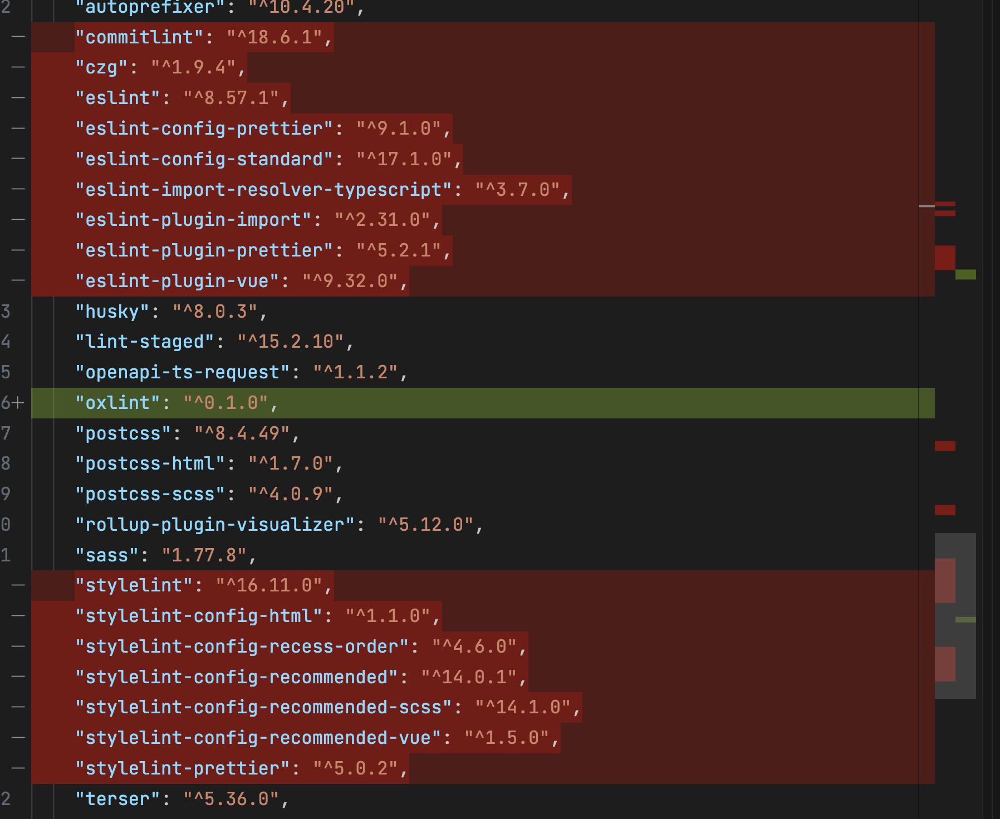

# CHANGELOG 更新日志

## v2.11.1(2025-06-11)

### hello-unibest

- 新增 `echarts` 和 `ucharts` demo。

### docs 文档

- 更新 `App 专题` 热更新内容。

## v2.11.0(2025-06-03)

### 架构优化

- 把 `v2.8.0(2025-05-20)` 版本删除的 `husky + commitlint` 配置加回来了。

### 依赖降级

- 将 `unocss` 从 `66.0.0` 降级到 `65.4.2`。(因为有部分网友会出现问题，所以降级了。)

### 新模板

- 新增 `base-sard-ui` 模板，方便用户直接使用 `sard-ui` 这个UI库开发。

## v2.10.1(2025-05-28)

### 新功能

- 实现基础的”登录“功能，后端接口数据是mock的。

## v2.9.3(2025-05-27)

### 新功能

- 支持 `spa` 模板，属于单页应用，完全自定义 `tabbar` 的形式。

### 依赖升级

- 将 `unocss` 从 `0.58` 升级到 `66.0.0`。
- 将 `wot-design-uni` 从 `^1.4.0` 升级到 `^1.9.0`。
- 将 `vue` 从 `3.4.21` 升级到 `^3.5.15`。
- 将 `vite` 从 `5.2.8` 升级到 `6.3.5`。

## v2.8.0(2025-05-20)

### 架构优化

- 移除 `stylelint` 和 `eslint` 配置，统一采用 `oxlint` 进行代码检查，提升代码校验的速度（比 `eslint` 快 `50-100` 倍）。
- ~~移除 `husky` 和 `commitlint` 配置(使用编辑器的AI生成commit信息)。~~(应网友要求，在v2.11.0加回来了)

  ::: details 对于 `v2.8.0` 以下版本，需按以下步骤操作：

  - 把 `stylelint, eslint` 相关依赖包删除
  - 安装 `oxlint`，设置 `lint-staged` 配置为 `oxlint`
  - 删除 `stylelint, eslint` 相关文件

  

  :::

## v2.7.0(2025-05-19)

### 依赖升级

- 将 `@dcloudio/uni-app` 从 `3.0.0-4020920240930001` 升级到 `3.0.0-4060520250512001`，获取最新功能和性能优化。

### 新功能

- 支持 `无 TabBar` 模式，用户只需删除 `pages.config.ts` 中的 `tabBar` 配置即可。

::: details 对于 `v2.7.0` 以下版本，需按以下步骤操作：

- 执行 `pnpm uvm` 升级 `@dcloudio/uni-app`。
- 修改 `src/utils/index.ts` 部分代码：

```ts
import pagesConfig from '@/pages.json'
const { pages, subPackages, tabBar = { list: [] } } = { ...pagesConfig }

/** 判断当前页面是否是 tabbar 页  */
export const getIsTabbar = () => {
  try {
    const lastPage = getLastPage()
    const currPath = lastPage?.route

    return Boolean(tabBar?.list?.some((item) => item.pagePath === currPath))
  } catch {
    return false
  }
}
```

:::
