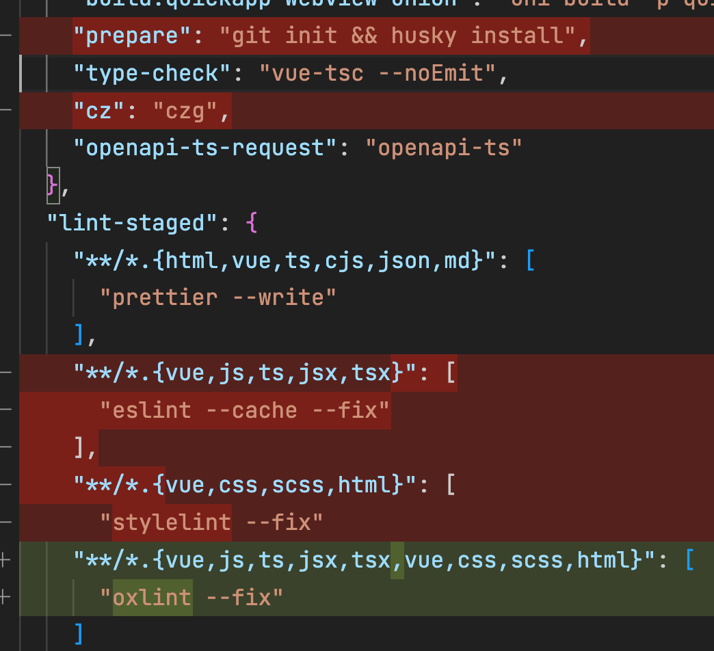
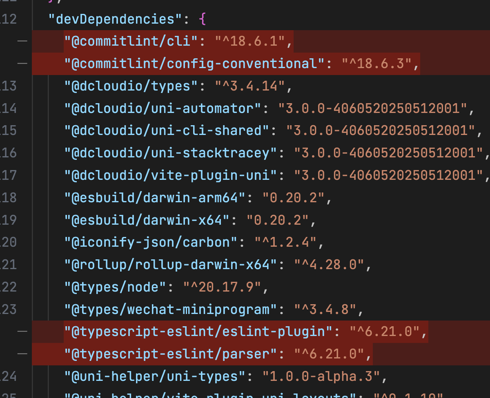

# CHANGELOG 更新日志

## v2.8.0(2025-05-20)

### 架构优化

- 移除 `stylelint` 和 `eslint` 配置，统一采用 `oxlint` 进行代码检查，提升代码质量和一致性。
- 移除 `husky` 和 `commitlint` 配置

  ::: details 对于 `v2.8.0` 以下版本，需按以下步骤操作：

  - 把 `husky, stylelint, eslint` 相关依赖包删除
  - 安装 `oxlint`，设置 `lint-staged` 配置为 `oxlint`
  - 删除 `husky, stylelint, eslint` 相关文件

  
  
  
  

  :::

## v2.7.0(2025-05-19)

### 依赖升级

- 将 `@dcloudio/uni-app` 从 `3.0.0-4020920240930001` 升级到 `3.0.0-4060520250512001`，获取最新功能和性能优化。

### 新功能

- 支持 `无 TabBar` 模式，用户只需删除 `pages.config.ts` 中的 `tabBar` 配置即可。

::: details 对于 `v2.7.0` 以下版本，需按以下步骤操作：

- 执行 `pnpm uvm` 升级 `@dcloudio/uni-app`。
- 修改 `src/utils/index.ts` 部分代码：

```ts
import pagesConfig from '@/pages.json'
const { pages, subPackages, tabBar = { list: [] } } = { ...pagesConfig }

/** 判断当前页面是否是 tabbar 页  */
export const getIsTabbar = () => {
  try {
    const lastPage = getLastPage()
    const currPath = lastPage?.route

    return Boolean(tabBar?.list?.some((item) => item.pagePath === currPath))
  } catch {
    return false
  }
}
```

:::
