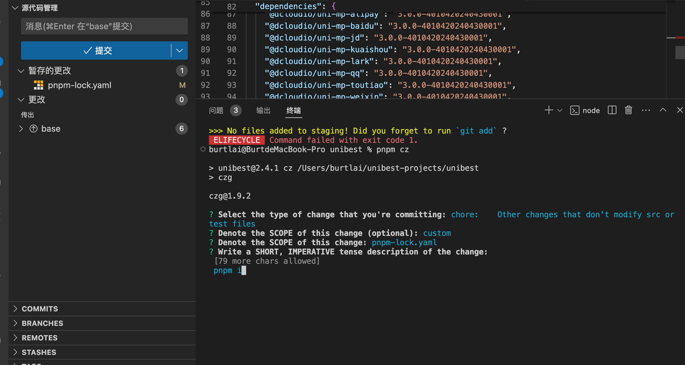
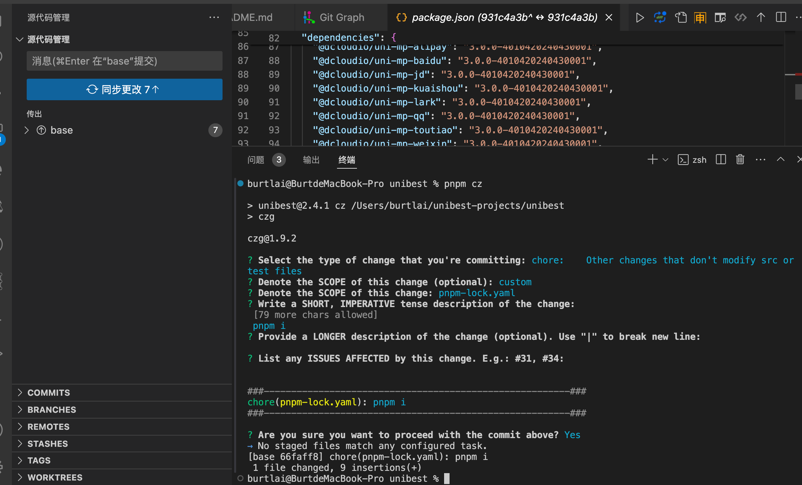

# Git 提交优化

> 本功能由 `⑤群` 群友 `Collapsar` 提供，感谢 `Collapsar` 的贡献。

## 使用

- `git add .` 添加文件
- 执行 `pnpm cz`，可以选择一系列提交类型如下面 `2` 图

最终提交信息如下图:

## czg 相关链接

- [为什么选择 czg](https://cz-git.qbb.sh/zh/cli/why)
