## iconfont 图标库

`iconfont` 同样有海量免费的图标，同时支持上传自己的图标。公司项目通常会有自己的图标，由专业的 `UI设计师` 设计，这时通常会使用 `iconfont` 方式使用图标。

- 1. 打开`阿里巴巴矢量图标库 iconfont`，地址：https://www.iconfont.cn/，并登录。
- 2. 寻找需要的图标，加入项目，也可以上传自己的图标。

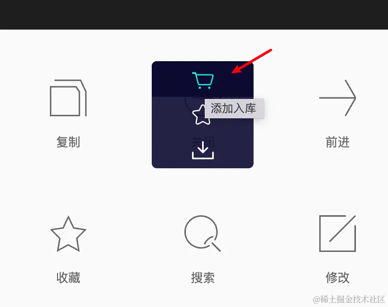

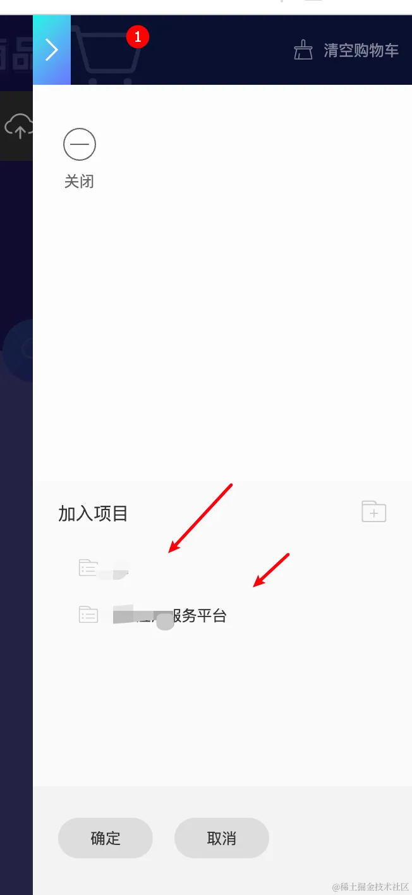

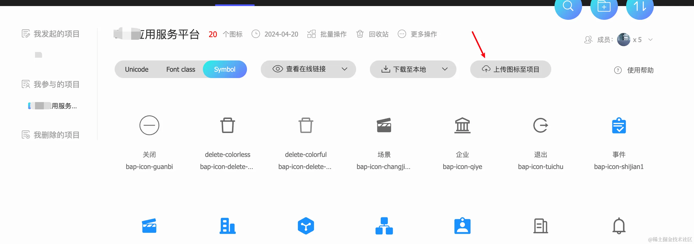

> 初次接触 `iconfont` 的同学，可能会找不到自己的项目，如下图：资源管理 -- 我的项目

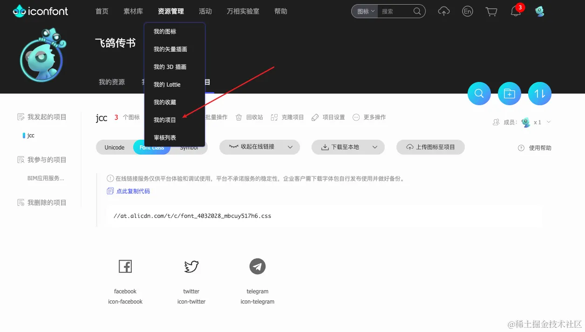

- 3.图标方式选择，如下图有 `Unicode` `Font class` `Symbol` 三种方式，分别预览和使用如下：

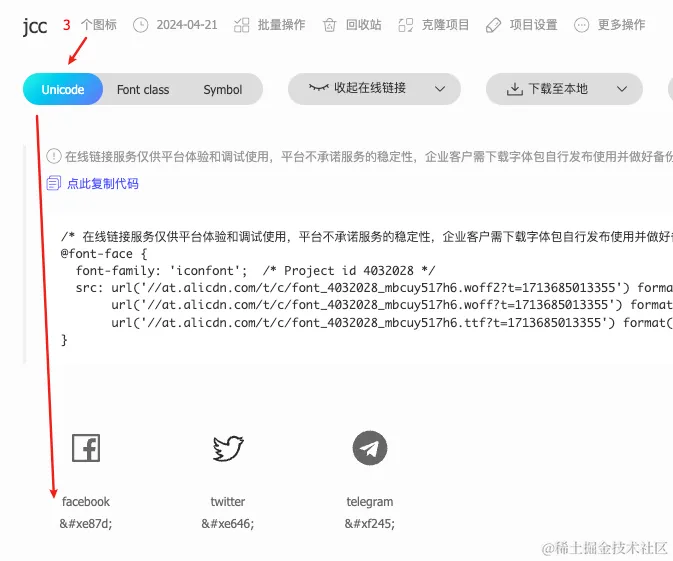

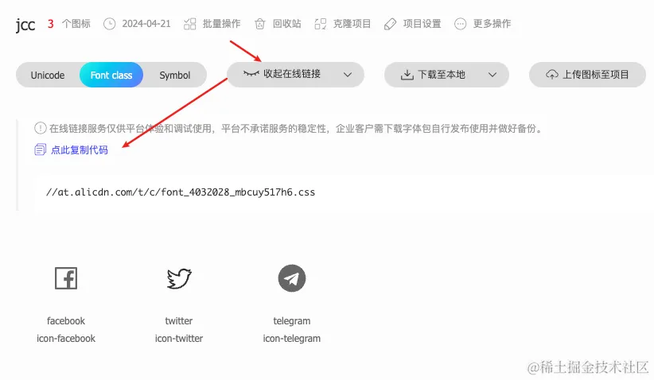

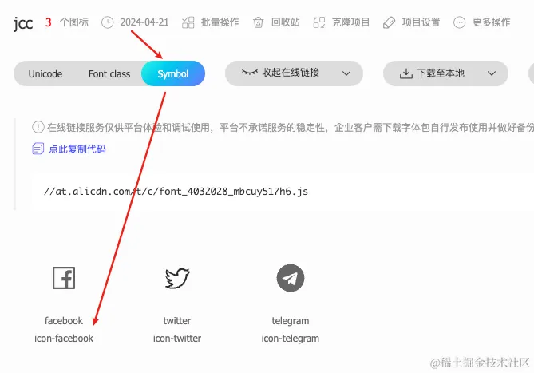

- `Unicode` 的方式太落后，语义化不明显，不推荐；
- `Symbol` 的方式太先进（背后原理是生成了 `SVG` 雪碧图），先进到 `小程序` 和 `APP` 都不支持，只能无奈放弃。

> `Symbol` 的方式生成 `svg` 雪碧图，如下所示：
>
> 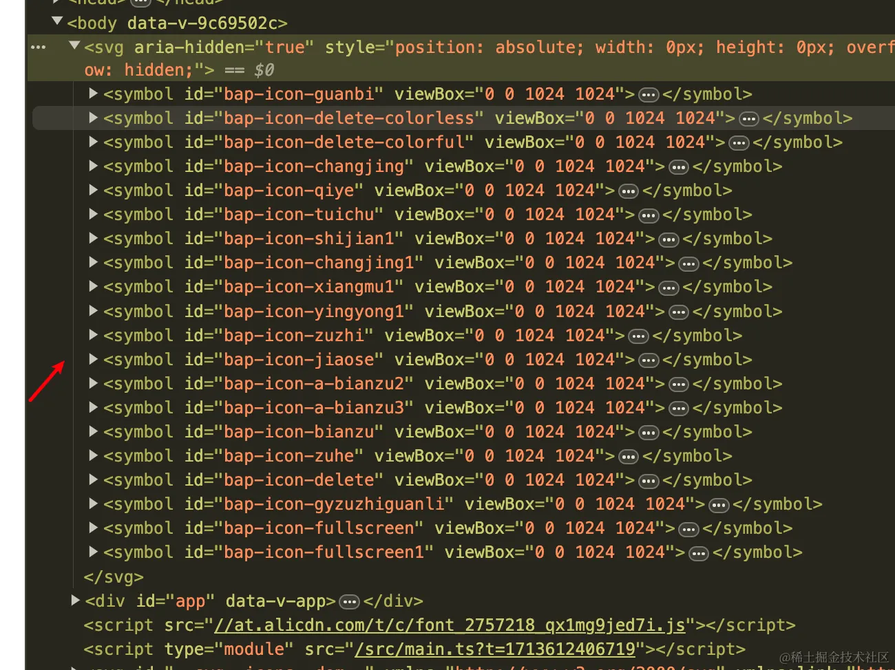

- `Font class` 则是我们最合适的选择，有 `Symbol` 一样的语义化（都是`icon-xxx`方式），引入和使用也方便（ `Symbol` 是一个 `js` 文件，`Font class` 是一个 `css` 文件）。

- 3. 点击选中 `Font class` 后再点击 `查看在线连接` 按钮，可以拿到一个 `css` 的链接，如 [//at.alicdn.com/t/c/font_4032028_mbcuy517h6.css](//at.alicdn.com/t/c/font_4032028_mbcuy517h6.css) ，如果期间新加入了图标，记得点击更新链接，会重新生成一个链接，只有最后面一串 hash 有改变，并且旧的链接依然可以访问。


我们使用的是 `Font class` 的方式，只需要这一个 `css` 链接就行，无需 `下载至本地`，想要本地预览的话才需要 `下载至本地`。

> `iconfont` 有默认的前缀 `icon-`，可以设置为其他的，如我的一个项目设置为 `bap-icon-`，以防跟其他的冲突。

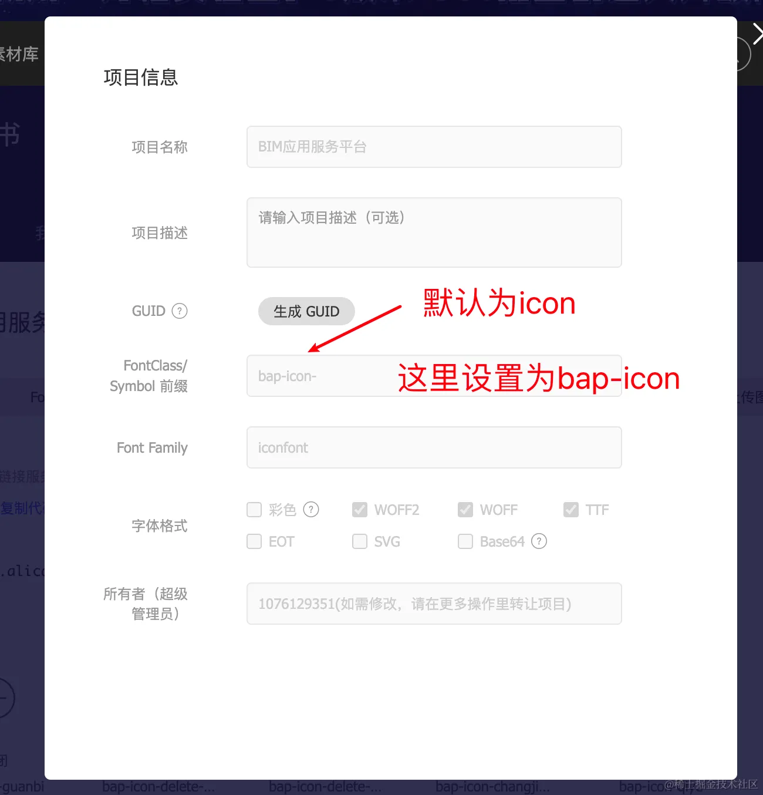

> 注意 `uniapp` 项目拿到 `css` 链接放到 `index.html` 是不对的，这样做只在 `h5` 中生效，`小程序` 和 `APP` 都不生效，正确的做法是放到代码里面显示引入。下面会讲：

- 4.在 `style/index.scss` 中写上上面的 `css` 链接里面的内容（`style/index.scss` 已经在 `main.ts` 引入了，`unibest` 模板已经内置），如下

> 注意： `url(//at.alicdn.com)` 里面的路径要改为 `url(https://at.alicdn.com)`，因为 APP 里面 `//` 是文件协议。 —— 设定 `https` 协议

```css
@font-face {
  font-family: iconfont; /* Project id 4032028 */
  src:
    url('//at.alicdn.com/t/c/font_4032028_mbcuy517h6.woff2?t=1713685013355') format('woff2'),
    url('//at.alicdn.com/t/c/font_4032028_mbcuy517h6.woff?t=1713685013355') format('woff'),
    url('//at.alicdn.com/t/c/font_4032028_mbcuy517h6.ttf?t=1713685013355') format('truetype');
}

.iconfont {
  font-family: iconfont !important;
  font-size: 16px;
  font-style: normal;
  -webkit-font-smoothing: antialiased;
  -moz-osx-font-smoothing: grayscale;
}

.icon-facebook::before {
  content: '\e87d';
}

.icon-twitter::before {
  content: '\e646';
}

.icon-telegram::before {
  content: '\f245';
}
```

- 5. 编写代码，`<i class="iconfont icon-facebook"></i>`

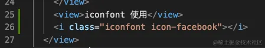

- 6. 预览，`h5 `端正常，APP 端不正常，小程序端看着正常，控制台也会报错，如下图：

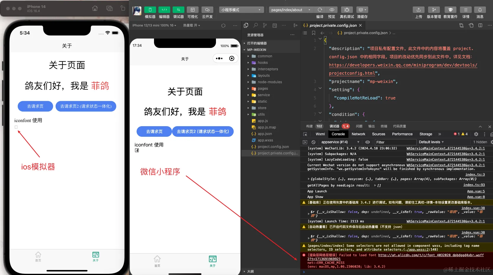

- 7. 这个怎么处理呢？转成 `base64` 是最快捷的，`iconfont` 本身就支持， `3`步搞定：

  - 7.1 如下图，勾选 `Base64`

    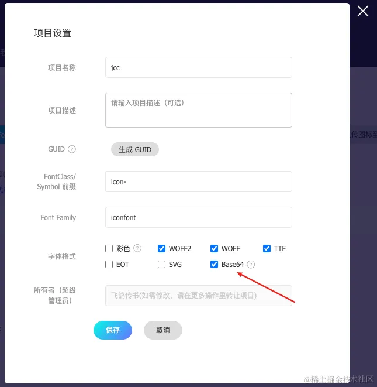

  - 7.2 生成新链接，并得到新的 `css` 代码

  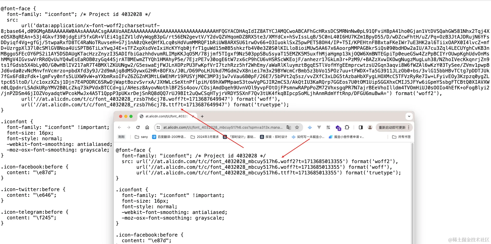

  - 7.3 引入新代码，刷新界面，小程序不报错了，APP 也正常了！

  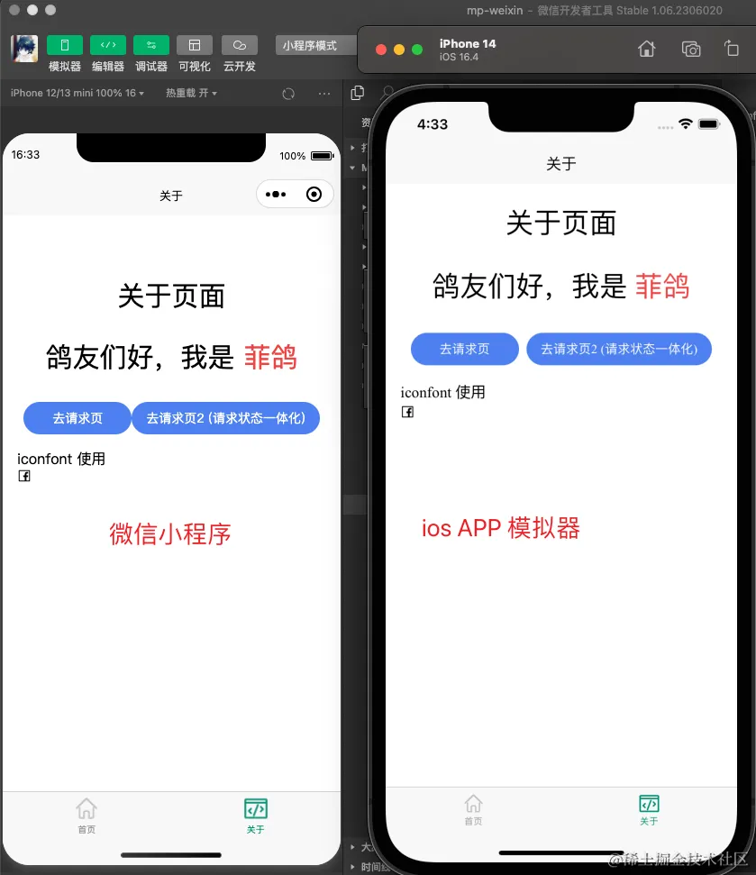

<!-- ### 批量去色

经我检测，不需要去色也支持动态改变颜色。可能去色是针对多色图标吧。


批量去色后要重新生成链接。 -->
