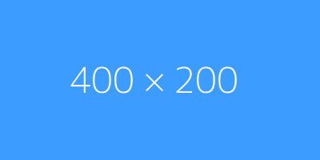

# 图片占位图

- 色块占位图
- 真实随机图片

## 色块占位图

下面是一个 `400x200 - 宽高，3c9cff - 背景颜色，fff - 文本颜色` 的色块占位图。



可以通过下面几种方式生成，效果一样：

| 官网地址                                            | 占位图片示例                                                                                             |
| :-------------------------------------------------- | :------------------------------------------------------------------------------------------------------- |
| [https://placeholder.com](https://placeholder.com/) | [https://via.placeholder.com/400x200.png/3c9cff/fff](https://via.placeholder.com/400x200.png/3c9cff/fff) |
| [https://dummyimage.com](https://dummyimage.com/)   | [https://dummyimage.com/400x200/3c9cff/fff](https://dummyimage.com/400x200/3c9cff/fff)                   |
| [https://fakeimg.pl](https://fakeimg.pl/)           | [https://fakeimg.pl/400x200/3c9cff/fff](https://fakeimg.pl/400x200/3c9cff/fff)                           |

代码编写举例：

```vue
<image src="https://via.placeholder.com/400x200.png/3c9cff/fff"></image>
```

## 真实随机图片

如果想生成某个宽高的随机图片，可以使用 [https://picsum.photos](https://picsum.photos)。

格式如：`https://picsum.photos/<width>/<height>?random=1`

举例：[https://picsum.photos/400/200?random=1](https://picsum.photos/400/200?random=1)

生成效果如下：


代码编写举例：

```vue
<image src="https://picsum.photos/400/200?random=1"></image>
```
